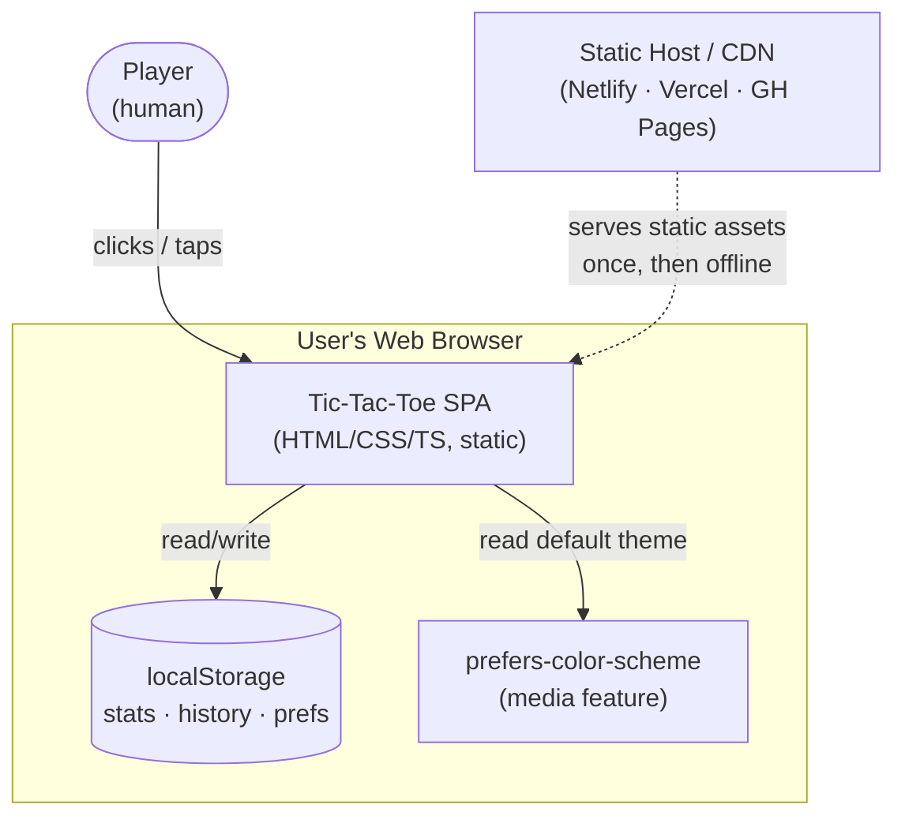
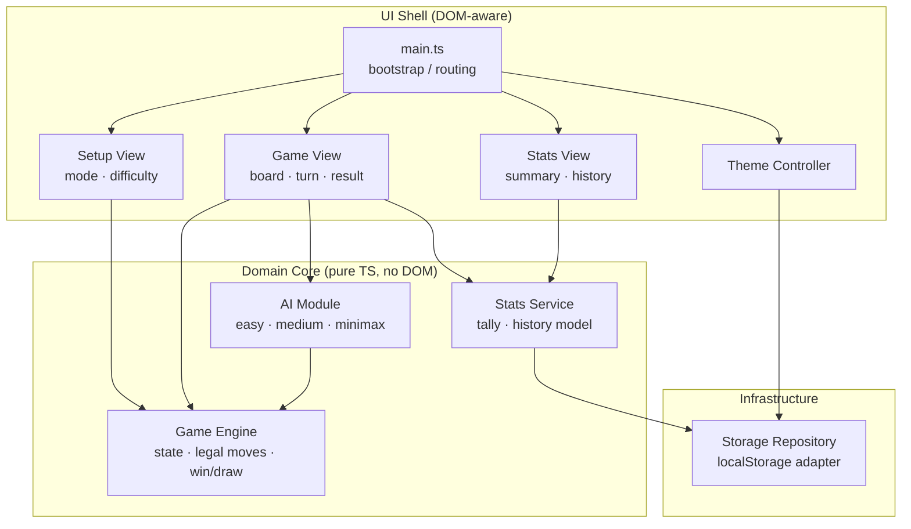
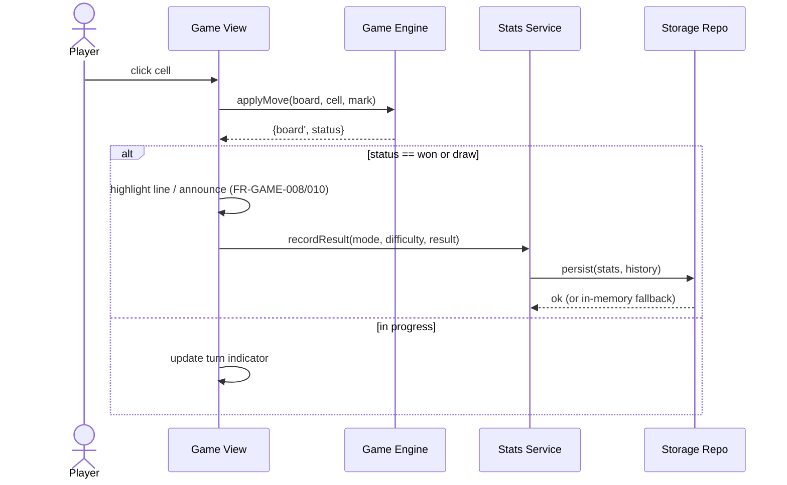

# Architecture: Tic-Tac-Toe Game

> Status: Draft · Last updated: 2026-07-09 · Author: zeeshanhanif

## 1. Introduction and Goals

This is the architecture for a browser-based Tic-Tac-Toe game. It is a
self-contained, client-side single-page application with no backend: the classic
3×3 game playable against a computer opponent (Easy / Medium / Hard-minimax) or
another person on the same device, with win/loss/draw statistics and match
history persisted locally.

Requirements are defined in [`docs/srs.md`](./srs.md) (the source of truth) and
elaborated in [`docs/use-cases.md`](./use-cases.md). This document references
those by ID rather than restating them.

**Top quality goals (ranked):**

1. **Maintainability & testability** [NFR-MAINT-001, NFR-MAINT-002] — the game
   rules and AI must live independently of the DOM so they can be unit-tested in
   isolation. This is the primary shaper of the internal structure.
2. **Portability** [NFR-PORT-001, NFR-PORT-002] — must build to static files,
   deploy to any static host/CDN, and run fully offline after load.
3. **Performance** [NFR-PERF-001, NFR-PERF-002, NFR-PERF-003] — moves reflected
   < 100 ms, Hard AI < 500 ms, interactive < 3 s.
4. **Privacy** [NFR-PRIV-001, NFR-PRIV-002] — no PII, no network calls during
   play; all data stays on-device.

## 2. Constraints

| # | Constraint | Source |
|---|------------|--------|
| C-1 | Client-side only; no server-side components or database | SRS §2.4 C-1 |
| C-2 | Persistence limited to browser `localStorage` | SRS §2.4 C-2 |
| C-3 | Must function fully offline after initial load | SRS §2.4 C-3 |
| C-4 | Assumes browser with JS + `localStorage` support | SRS §2.5 A-1 |
| C-5 | Stack: Vanilla TypeScript + Vite (this decision — ADR-001/ADR-002) | Elicited |
| C-6 | Single-developer project; minimal ops appetite | Elicited |

## 3. Context and Scope

The system is a single web page loaded by the user's browser. Its only external
touchpoints are the browser's `localStorage` (persistence) and the
`prefers-color-scheme` media feature (default theming). There is no network
communication after the assets are served, and no backend.



**External interfaces:** `localStorage` API (SI-1), `prefers-color-scheme`
(SI-2), pointer/touch input. No communication interfaces (SRS §5.4).

## 4. Solution Strategy

- **Single static SPA, no backend** — the whole product is HTML/CSS/JS served
  statically (ADR-001). Driven by C-1, NFR-PORT-001.
- **Vanilla TypeScript + Vite** — no UI framework; TypeScript for a typed,
  testable core (ADR-002). Driven by NFR-MAINT-001, project size, C-6.
- **Layered separation: pure domain core vs. UI shell** — all game rules, AI,
  and outcome logic are framework-free pure functions/modules; a thin UI layer
  renders state and forwards input (ADR-003). Driven by NFR-MAINT-001/002.
- **`localStorage` behind a repository abstraction** — persistence isolated
  behind one module that degrades gracefully when storage is unavailable
  (ADR-004). Driven by C-2, NFR-REL-002.
- **Vitest for unit tests** — co-located with Vite, tests the domain core
  (ADR-005). Driven by NFR-MAINT-002.

## 5. Building Block View

One deployable artifact (the static bundle). Internally it is organized into a
**pure domain core** (no DOM, fully testable) and a **UI shell** that depends
inward on the core — dependencies point toward the core, never outward.



**Building blocks:**

- **Game Engine** (core) — owns board state, turn management, legal-move
  validation, and win/draw detection as pure functions over an immutable board.
  Realizes FR-GAME-002..010, FR-MODE (turn order). No DOM, no timers.
- **AI Module** (core) — given a board and difficulty, returns the next move.
  Easy = random legal (FR-AI-001); Medium = win/block-else-random (FR-AI-002);
  Hard = minimax, guaranteed non-losing (FR-AI-003). Pure; depends only on the
  Game Engine's rules.
- **Stats Service** (core) — updates W/L/D tallies and appends match-history
  records at game end (FR-STATS-001/002/007); reads them for display
  (FR-STATS-003/004). Serializable plain data; delegates persistence to the
  Storage Repository.
- **Storage Repository** (infra) — the only module that touches `localStorage`
  (FR-STATS-005, FR-THEME-003, FR-MODE-005). Wraps reads/writes in try/catch and
  falls back to an in-memory store when storage is unavailable (NFR-REL-002).
- **UI Shell** (DOM) — `main.ts` bootstraps and switches between Setup, Game,
  and Stats views (FR-UI-002); views render core state and forward clicks; the
  Theme Controller applies/persists light-dark (FR-THEME-*). The AI move delay
  and winning-line highlight (FR-AI-004, FR-GAME-008) live here, not in the core.

## 6. Runtime View

**Human move & outcome resolution [UC-02, UC-04]:**



**Computer turn [UC-03]** (vs. Computer, AI's turn): after a human move that
leaves the game in progress, the Game View schedules the AI via a short delay
(FR-AI-004), calls `AI.chooseMove(board, difficulty)` → `Game Engine.applyMove`,
then resolves the outcome exactly as above. Illegal moves are impossible because
the AI selects only from the engine's legal moves (FR-AI-005). Occupied-cell and
after-game clicks are rejected by the engine and ignored by the view
(FR-GAME-003/004).

## 7. Deployment View

A single static bundle (`index.html` + hashed JS/CSS assets) produced by
`vite build`, uploaded to any static host or CDN (Netlify, Vercel, GitHub
Pages). No runtime, no environment configuration, no secrets. Cache-busting via
Vite's content-hashed filenames; the app runs offline after first load
(NFR-PORT-002). Topology is trivial — no deployment diagram warranted.

## 8. Cross-cutting Concepts

- **Security & privacy** — no auth (no accounts, SRS §2.2); no PII collected or
  transmitted (NFR-PRIV-001); zero network calls during play (NFR-PRIV-002). The
  only stored data is game stats/prefs in `localStorage`, treated as
  non-sensitive.
- **Data & persistence** — plain serializable objects (stats tallies, an
  append-only history array, theme/settings) written as JSON under versioned
  `localStorage` keys via the Storage Repository. A schema-version field guards
  against format changes; unreadable/corrupt data resets to defaults rather than
  crashing. No backup/recovery obligations (device-local by design).
- **Resilience & error handling** — the domain core is total over valid inputs;
  the engine rejects illegal moves instead of throwing. `localStorage` access is
  wrapped so quota/availability failures degrade to a session-only in-memory
  store (NFR-REL-002). Rapid/duplicate input is idempotent because moves validate
  against current board state (NFR-REL-001).
- **Observability** — none required (no backend, no telemetry, privacy-first).
  Development uses console diagnostics only.
- **Performance & scaling** — "scaling" is per-client and constant: a 3×3 board
  has a tiny state space, so minimax explores the full game tree instantly, well
  within the 500 ms budget (NFR-PERF-002); no memoization needed but trivial to
  add. Rendering touches nine cells, so moves are effectively instant
  (NFR-PERF-001). Vite tree-shakes to a small bundle for < 3 s interactivity
  (NFR-PERF-003).

## 9. Architecture Decisions

### ADR-001 — Client-side static SPA, no backend
- **Status:** Accepted
- **Context:** The product is a local game with device-local stats; the SRS
  forbids server components and mandates offline operation.
- **Decision:** Ship a purely client-side single-page app as static assets.
- **Options considered:** (a) Static SPA; (b) SPA + thin backend for stats sync;
  (c) full-stack app. (b)/(c) add hosting, ops, and privacy surface for zero
  required benefit.
- **Consequences:** Trivial hosting and offline support; no cross-device sync
  and no server-side leaderboard (both out of scope). 
- **Requirements addressed:** C-1, NFR-PORT-001, NFR-PORT-002, NFR-PRIV-002.

### ADR-002 — Vanilla TypeScript + Vite (no UI framework)
- **Status:** Accepted
- **Context:** A 3×3 game has a tiny UI surface; a single developer wants a
  small, fast, low-dependency codebase, but also type safety on the core logic.
- **Decision:** Build with plain TypeScript and Vite; no React/Svelte.
- **Options considered:** (a) Vanilla TS+Vite; (b) React+Vite; (c) Svelte. A
  framework adds bundle weight and concepts that this UI doesn't need; TS gives
  the type safety that most benefits the engine/AI.
- **Consequences:** Smallest bundle and fastest load; manual DOM rendering in the
  UI shell (a modest, well-contained cost given the tiny view count).
- **Requirements addressed:** NFR-MAINT-001, NFR-PERF-003, NFR-PORT-001.

### ADR-003 — Layered separation: pure domain core vs. UI shell
- **Status:** Accepted
- **Context:** The SRS explicitly requires game logic decoupled from the UI and
  unit-tested.
- **Decision:** Put all rules, AI, and stats logic in DOM-free modules that the
  UI depends on one-directionally; keep timers, highlighting, and rendering in
  the shell.
- **Options considered:** (a) Layered core/shell; (b) logic intermixed with DOM
  handlers. (b) makes the core untestable without a DOM.
- **Consequences:** Core is testable in pure Node/Vitest with no DOM mocks; a
  clear seam to later swap the UI layer if ever desired.
- **Requirements addressed:** NFR-MAINT-001, NFR-MAINT-002.

### ADR-004 — `localStorage` behind a Storage Repository with graceful fallback
- **Status:** Accepted
- **Context:** Persistence is required but `localStorage` can be disabled, full,
  or throw; the app must still work.
- **Decision:** Route all persistence through one repository module that
  serializes JSON under versioned keys and falls back to an in-memory store on
  failure.
- **Options considered:** (a) Repository abstraction; (b) call `localStorage`
  directly from views. (b) scatters error handling and couples views to storage.
- **Consequences:** Single place for schema versioning and error handling;
  session-only degradation when storage is unavailable.
- **Requirements addressed:** FR-STATS-005, FR-THEME-003, FR-MODE-005,
  NFR-REL-002.

### ADR-005 — Vitest for unit testing the domain core
- **Status:** Accepted
- **Context:** NFR-MAINT-002 mandates automated tests for win detection and AI.
- **Decision:** Use Vitest (shares Vite config/transform) to unit-test the core.
- **Options considered:** (a) Vitest; (b) Jest. Vitest integrates with the Vite
  toolchain with no extra transform config.
- **Consequences:** Fast, zero-config tests; ties test tooling to the Vite
  ecosystem (acceptable, non-critical lock-in).
- **Requirements addressed:** NFR-MAINT-002.

## 10. Quality Requirements

| Scenario | Target | Source |
|----------|--------|--------|
| Player taps an empty cell | Mark rendered within 100 ms | NFR-PERF-001 |
| Hard AI computes its move on a mid-range device | Move played within 500 ms | NFR-PERF-002 |
| First load on broadband | Interactive within 3 s | NFR-PERF-003 |
| `localStorage` disabled/full | App still playable; stats non-persistent, no crash | NFR-REL-002 |
| Hard AI over many games | Never loses (only wins or draws) | FR-AI-003 |
| Corrupt/old stored data on load | Resets to defaults, no crash | NFR-REL-001 |

## 11. Risks and Technical Debt

- **Manual DOM rendering** (from the no-framework choice) can grow error-prone if
  scope expands (e.g., online play, board variants). Mitigation: keep views thin;
  revisit ADR-002 if the UI surface grows materially.
- **Device-local persistence** means stats don't survive clearing browser data or
  moving devices — acceptable and by design, but worth stating to users.
- **No observability** — bugs in the wild are invisible. Acceptable for a
  privacy-first offline game; revisit only if a support need arises.
- **Assumption:** the 3×3 minimax is cheap enough to run un-memoized within
  budget. Holds comfortably for 3×3; would need revisiting only if board variants
  (out of scope) were ever added.
```
