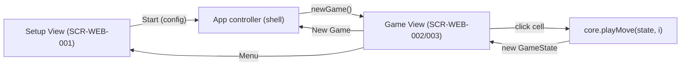

# Technical Design: FEAT-001 — Local two-player match

> Feature from: docs/implementation-plan.md · Epic: EPIC-GAME (Core Gameplay)
> Implements: FR-GAME-001..012, FR-MODE-001 (partial), FR-MODE-004 (partial)
> Realizes: UC-01 (partial — 2-player), UC-02, UC-04 (partial — result only), UC-05
> Screens: SCR-WEB-001 (2-player path), SCR-WEB-002, SCR-WEB-003 (designed by ui-design)
> Status: Draft · Date: 2026-08-06

## 1. Intent

A complete, demonstrable human-vs-human Tic-Tac-Toe match on one device: pick
Local Two-Player, play alternating moves, reach a win or draw, see the result,
and play again or return to setup. It is first because it forces the pure
**Game Engine** — immutable board, legal-move validation, turn management,
win/draw detection — into existence with unit tests, validating the layered
architecture (NFR-MAINT-001/002) that every later slice depends on. Statistics
recording (the rest of UC-04) is out of scope here — it arrives in FEAT-004.

## 2. Codebase context

Design conforms to what the walking skeleton established (see
`docs/scaffold-notes.md`, CLAUDE.md):

- **This is a client-only SPA** (ADR-001). There is **no API and no database**,
  so this design has no §3 REST contracts and no §4 SQL migrations in the usual
  sense — the "contract" is the **core module's public function signatures**
  (below), and the "schema" is the in-memory `GameState` shape. Both sections
  are reframed accordingly.
- **Module boundaries (ADR-003, ESLint-enforced):** `src/core/**` is pure, no
  DOM, no imports from `ui/`/`infra/`. Turn/end/win logic therefore lives in
  `core/`, not in the view.
- **Existing core (`src/core/board.ts`):** `Mark`, `CellValue`, `Board`
  (readonly 9-cell array, row-major), `EMPTY_BOARD`, `GameStatus`
  (`in-progress | won{mark,line} | draw`), `MoveResult`, `isEmptyCell`,
  `applyMove(board,index,mark)` — placement + occupied-cell rejection are
  already real. **`evaluateStatus(board)` is a STUB** (`TODO(FEAT-001)`, always
  returns `in-progress`) — this feature replaces its body.
- **Existing UI:** `src/ui/views/game.ts` renders the board with skeleton
  alternate-mark logic; `setup.ts`/`stats.ts` are placeholders;
  `src/ui/shell.ts` switches views and currently lands on `game`. `game.ts`'s
  local turn logic and `shell.ts`'s default view are replaced by this feature.
- **Tests:** Vitest, `src/core/board.test.ts` (2 skeleton tests). Convention:
  `.test.ts` beside the module, explicit `vitest` imports, `.ts` import
  extensions (tsconfig bundler mode). Architecture's testing strategy (ADR-005,
  §8) is **unit tests for the domain core**; no E2E harness or named critical
  E2E flow exists → the E2E-extension task is legitimately skipped.
- **Design tokens** are wired (`var(--…)` from `docs/tokens.json`); UI tasks
  consume tokens, never hand-copied values.

## 3. Contracts — core module public API

The Game Engine surface the UI and implementation build against (pure,
DOM-free). Two existing primitives are kept; the outcome function is completed;
a small stateful reducer is added for turn/end management so the view stays thin.

### 3.1 `core/board.ts` (existing — completed here)

```ts
// COMPLETED (replaces the stub): scans the 8 winning lines, then draw, else in-progress.
function evaluateStatus(board: Board): GameStatus;
//  → { kind: "won", mark, line: [i,j,k] }  when a line holds 3 equal non-null marks
//  → { kind: "draw" }                        when board full and no winning line
//  → { kind: "in-progress" }                 otherwise
// The winner is derived from the board (the mark on the completed line) — no
// turn context needed. `line` carries the winning indices for the UI highlight.

const WINNING_LINES: readonly (readonly [number, number, number])[]; // 3 rows, 3 cols, 2 diagonals
```

`applyMove(board, index, mark)` and `isEmptyCell` are unchanged; `applyMove`
now returns a real `status` because `evaluateStatus` is real.

### 3.2 `core/game.ts` (new — turn/end reducer)

```ts
interface GameState {
  readonly board: Board;
  readonly current: Mark;      // whose turn it is (X first — FR-GAME-005)
  readonly status: GameStatus; // in-progress | won | draw
}

// Fresh game, empty board, `first` to move (default "X").
function newGame(first?: Mark): GameState;

// Apply the current player's move at `index`. Pure — returns a new state.
// Rejects (returns state unchanged, applied:false) when the game has ended
// (FR-GAME-004) or the cell is occupied/out-of-range (FR-GAME-003). On a valid
// move: places `current`'s mark, re-evaluates status; if still in-progress,
// flips `current`; if won/draw, `current` is left as-is.
function playMove(state: GameState, index: number): { state: GameState; applied: boolean };
```

This reducer is the single home for FR-GAME-003/004/005 — the view never
decides legality or turn order.

## 4. State shape (in lieu of DB schema)

No persistent store this slice (persistence is FEAT-004). The only state is the
in-memory `GameState` above plus a UI-level `GameConfig` passed from Setup:

```ts
type GameMode = "two-player" | "vs-computer";
interface GameConfig { mode: GameMode; } // FEAT-001 implements only "two-player"
```

`GameConfig` is a UI-shell concern (not core). vs-computer fields (difficulty,
side) are added by FEAT-002 — deliberately absent here.

## 5. Component design



- **`core/board.ts`** — complete `evaluateStatus` + add `WINNING_LINES`.
  Replaces the `TODO(FEAT-001)` stub.
- **`core/game.ts`** (new) — `GameState`, `newGame`, `playMove`. Owns turns and
  end-of-game rejection. Unit-tested.
- **`core/index.ts`** — re-export `game.ts` alongside `board.ts`.
- **`ui/views/game.ts`** — thin renderer of `GameState`: 3×3 board
  (FR-GAME-001), turn indicator as **visible text** "X's turn / O's turn"
  (FR-GAME-006; NFR-USE-003), result banner "X wins / O wins / Draw" on end
  (FR-GAME-010), winning-line highlight on the three `status.line` cells
  (FR-GAME-008 — highlight lives in the UI per architecture §5), **New Game**
  (FR-GAME-011) and **Menu** (FR-GAME-012) controls. Delegates every click to
  `playMove`; ignores rejected moves. Replaces the skeleton alternate-mark code.
- **`ui/views/setup.ts`** — mode segmented control; **Local Two-Player** starts
  a game via the app controller; **vs-Computer** is present but its
  difficulty/side config is deferred to FEAT-002 (start disabled or noted).
  Replaces the placeholder. (FR-MODE-001/004 partial.)
- **`ui/shell.ts`** — app controller: holds the active `GameConfig`, routes
  Setup→Game→(New Game|Menu), and **lands on Setup** (not Game). Replaces the
  `show("game")` default.

## 6. Acceptance criteria

Main flow, consequential alternates/exceptions, and binding NFRs. Each cites
its source.

- **AC-1** (FR-GAME-001, UC-01): A new two-player game renders a 3×3 grid of 9
  empty, selectable cells.
- **AC-2** (FR-GAME-005, UC-01): A new game has **X to move first**; the turn
  indicator says so.
- **AC-3** (FR-GAME-002, UC-02): Selecting an empty cell places the active
  player's mark in it.
- **AC-4** (FR-GAME-005, UC-02): After a valid move with the game continuing,
  the turn passes to the other mark and the indicator updates.
- **AC-5** (FR-GAME-003, UC-02 1a): Selecting an occupied cell is ignored —
  board and turn unchanged.
- **AC-6** (FR-GAME-004, UC-02 1b): After the game has ended, any cell selection
  is ignored — board unchanged.
- **AC-7** (FR-GAME-007, UC-04): Three identical marks in any row, column, or
  diagonal are detected as a win by that mark. (All 8 lines covered.)
- **AC-8** (FR-GAME-008, UC-04): On a win, the three winning cells are visually
  highlighted.
- **AC-9** (FR-GAME-009, UC-04): A full board with no winning line is detected
  as a draw.
- **AC-10** (FR-GAME-010, UC-04; NFR-USE-003): On game end the result is
  announced in **visible text** — "X wins" / "O wins" / "Draw" — not by color
  alone.
- **AC-11** (FR-GAME-011, UC-05): "New Game" clears the board to empty with X to
  move, keeping the current two-player config.
- **AC-12** (FR-GAME-012, UC-05 1a): A "Menu" control returns to Setup.
- **AC-13** (FR-MODE-001, FR-MODE-004, UC-01): From Setup, choosing Local
  Two-Player and Start launches a two-player game on an empty board.
- **AC-14** (NFR-PERF-001): A human move is reflected on the board within 100 ms
  of the click/tap.
- **AC-15** (NFR-REL-001): Rapid/repeated clicks (incl. occupied and after-end)
  never crash or corrupt state — moves validate against current state
  (idempotent).
- **AC-16** (NFR-USE-002): Cells and action buttons are ≥ 44×44 CSS px on touch.
- **AC-17** (NFR-MAINT-001, NFR-MAINT-002): Win/draw detection and turn logic
  live in the DOM-free core and are covered by Vitest unit tests.

## 7. Decisions

- **D1 — Turn/end management in the core, not the view.** Driver: NFR-MAINT-001,
  ADR-003. Alternative (keep the skeleton's in-view alternation) rejected: it is
  untestable without a DOM and leaks rules into `ui/`. Consequence: `game.ts`
  view becomes a thin `GameState` renderer.
- **D2 — Outcome derived from the board.** `evaluateStatus(board)` reads the
  winner off the completed line rather than taking the last-moved mark. Driver:
  purity/testability. Consequence: one context-free source of truth for the
  result.
- **D3 — Winning line carried in `GameStatus.won.line`.** Driver: FR-GAME-008
  highlight lives in the UI (architecture §5) and should not re-scan the board.
  Consequence: the view highlights `status.line` directly.
- **D4 — `GameConfig` passed Setup→Game; only `two-player` functional.** Driver:
  plan sequencing — FEAT-002 owns vs-computer. Consequence: Setup renders the
  mode control now, but only the 2-player path starts a game this slice.

## 8. Escalations & open items

- **None.** No new domain entity, no consistency-boundary change (no persistence
  this slice). Schema-ownership rule not triggered. E2E-extension task omitted —
  the architecture names no critical E2E flow and the project has unit tests
  only (ADR-005). vs-Computer setup UI is intentionally deferred to FEAT-002,
  not an open gap.
