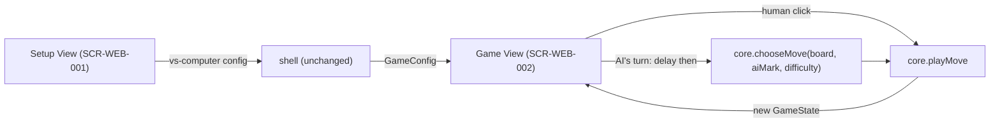

# Technical Design: FEAT-002 — vs-Computer setup + Easy/Medium AI

> Feature from: docs/implementation-plan.md · Epic: EPIC-AI (Computer Opponent)
> Implements: FR-AI-001, FR-AI-002, FR-AI-004, FR-AI-005, FR-MODE-002 (partial),
> FR-MODE-003; completes FR-MODE-001, FR-MODE-004
> Realizes: UC-01 (complete — vs-Computer), UC-03 (Easy/Medium)
> Screens: SCR-WEB-001 (vs-Computer path), SCR-WEB-002 (computer-thinking state)
> Status: Draft · Date: 2026-08-07

## 1. Intent

Turn the local-only game into a solo game against the computer: on Setup, pick
**Vs. Computer**, a **difficulty**, and which **side** you play; in-game the AI
takes its turn automatically after a brief delay. Easy plays a random legal
move; Medium wins-if-it-can, else blocks, else random. This builds the AI
dispatch + auto-move harness that **FEAT-003 (Hard minimax)** plugs into — so
the Hard option is present but deferred to that slice.

## 2. Codebase context

Design conforms to what FEAT-001 established (verified, committed):

- **Client-only SPA** (ADR-001) — no API, no DB. "Contracts" = core module
  function signatures; "schema" = in-memory `GameConfig`/`GameState`. No §4
  migrations.
- **Module boundaries (ADR-003, ESLint-enforced):** the AI is pure domain →
  `src/core/ai.ts`. The move **delay, auto-move, and input-lock are UI**
  (architecture §5 says timers/highlighting live in the shell, not core).
- **Existing core:** `board.ts` (`Board`, `Mark`, `evaluateStatus`, `applyMove`,
  `isEmptyCell`, `WINNING_LINES`), `game.ts` (`GameState`, `newGame(first)`,
  `playMove(state,i) → {state, applied}`). The AI reuses these — no changes to
  them. `core/index.ts` re-exports both; add `ai.ts`.
- **Existing UI:** `ui/config.ts` (`GameConfig{mode}`, `GameMode`,
  `PLAYER_LABELS`), `ui/views/setup.ts` (mode cards; vs-Computer card present but
  disabled with "Coming soon (FEAT-002)"), `ui/views/game.ts` (thin `GameState`
  renderer; scoreboard uses `PLAYER_LABELS`), `ui/shell.ts` (passes `GameConfig`
  generically — **no shell change needed**; it already routes any config).
  `ui/dom.ts` (`el`, `topbar`). `infra/logger.ts` (`log`).
- **Design tokens** wired; the vs-Computer Setup controls (segmented difficulty,
  side pills) and the "thinking" turn state already have component specs in
  `design.md §4` and the source screen (registered SCR-WEB-001/002).
- **Tests:** Vitest, `.test.ts` beside module, explicit imports. Architecture
  testing strategy = unit tests for the core (ADR-005) → **AI logic is
  unit-tested**; UI orchestration verified by running the app. No E2E owed.

## 3. Contracts — core AI module (`src/core/ai.ts`, new)

Pure, DOM-free, synchronous. Randomness is **injected** so tests are
deterministic (NFR-MAINT-002).

```ts
export type Difficulty = "easy" | "medium" | "hard";

/** Indices of empty cells (legal moves). */
export function legalMoves(board: Board): number[];

/** A cell where placing `mark` immediately completes a line, else null. */
export function findWinningMove(board: Board, mark: Mark): number | null;

/**
 * Choose a legal move for `mark` at the given difficulty. Pure; `rng` (default
 * Math.random) makes the random paths testable. Always returns an empty cell
 * (FR-AI-005) — throws only if the board is full (never called then).
 *   easy   → uniformly random legal move (FR-AI-001)
 *   medium → win-if-possible, else block opponent win, else random (FR-AI-002)
 *   hard   → THROWS "not implemented (FEAT-003)" — minimax lands in FEAT-003
 */
export function chooseMove(
  board: Board,
  mark: Mark,
  difficulty: Difficulty,
  rng?: () => number,
): number;
```

`chooseMove` composes existing `board.ts` primitives: `legalMoves` from
emptiness, `findWinningMove` by trial-placing via `applyMove`/`evaluateStatus`.
Medium = `findWinningMove(board, mark)` ?? `findWinningMove(board, other(mark))`
?? random. The `hard` branch is a guarded stub (`TODO(FEAT-003)`) — unreachable
in FEAT-002 because the UI disables Hard (see D3).

## 4. State shape (extends `ui/config.ts`)

```ts
export interface GameConfig {
  mode: GameMode;              // "two-player" | "vs-computer"
  difficulty?: Difficulty;     // vs-computer only (easy | medium; hard = FEAT-003)
  humanMark?: Mark;            // vs-computer only — which side the human plays (FR-MODE-003)
}
```

`difficulty`/`humanMark` are optional and present only for `vs-computer`.
`Difficulty` is imported from `core` (a domain concept). `X` always moves first
(FR-GAME-005); if `humanMark === "O"`, the AI (X) moves first.

## 5. Component design



- **`core/ai.ts`** (new) — `Difficulty`, `legalMoves`, `findWinningMove`,
  `chooseMove` (easy/medium; hard stub). Re-exported from `core/index.ts`.
- **`ui/config.ts`** — extend `GameConfig` (§4); add a label helper or inline
  mode-aware labels (below).
- **`ui/views/setup.ts`** — enable the **Vs. Computer** card; when selected,
  reveal a **Difficulty** segmented control (Easy / Medium / **Hard disabled**,
  "Hard — FEAT-003") and a **"You play as"** X/O pill pair (FR-MODE-003, default
  X). Build the extended `GameConfig`. Two-player path unchanged. Start enabled
  for two-player and for vs-Computer with Easy/Medium.
- **`ui/views/game.ts`** — the orchestration:
  - **Mode-aware scoreboard labels:** two-player → `PLAYER_LABELS` (Player 1/2);
    vs-computer → human card "You", AI card "Computer" with difficulty sub
    (e.g., "Medium AI").
  - **AI turn:** when `mode==="vs-computer"` and it's the AI's turn
    (`state.current === aiMark`, `status==="in-progress"`), set an `aiThinking`
    flag, render the **"Computer is thinking…"** turn state, and after a brief
    perceptible **delay (~400 ms, FR-AI-004)** call
    `chooseMove(board, aiMark, difficulty)` → `playMove` → re-render.
  - **Input lock:** while `aiThinking`, `onCellClick` is a no-op and cells are
    not `playable` (prevents double-moves — AC-10 / NFR-REL-001).
  - **AI-first:** if `humanMark==="O"`, the AI (X) is to move on a fresh game →
    the thinking/timeout kicks off on mount and on New Game.
  - `aiMark = other(humanMark)`; `humanMark` defaults to X.
- **`ui/shell.ts`** — unchanged (passes `GameConfig` through).

## 6. Acceptance criteria

- **AC-1** (FR-MODE-001, UC-01): On Setup, selecting **Vs. Computer** reveals the
  difficulty and side controls; Start launches a vs-Computer game.
- **AC-2** (FR-MODE-002, *partial*): The difficulty control offers Easy, Medium,
  Hard; **Easy and Medium are selectable and start a game** (Hard is disabled —
  completed by FEAT-003, see D3).
- **AC-3** (FR-MODE-003): The user can choose to play **X (first) or O (second)**;
  the chosen mark is the human's, the other is the AI's.
- **AC-4** (FR-AI-004): On the AI's turn, its move is played **automatically
  after a brief perceptible delay**; during the delay the board ignores human
  input and a "thinking" indicator shows.
- **AC-5** (FR-MODE-003): When the human chose **O**, the AI (X) makes the
  **first** move.
- **AC-6** (FR-AI-001): On **Easy**, `chooseMove` returns a uniformly random
  legal cell (verified via injected RNG).
- **AC-7** (FR-AI-002): On **Medium**, `chooseMove` returns an immediately
  winning move if one exists; else a move blocking the opponent's immediate win
  if one exists; else a random legal move — in that priority.
- **AC-8** (FR-AI-005): For **every** difficulty, `chooseMove` returns only an
  empty (legal) cell.
- **AC-9** (FR-MODE-004): Starting a vs-Computer game uses the selected
  difficulty and side (the AI plays `other(humanMark)` at the chosen difficulty).
- **AC-10** (NFR-REL-001): AI auto-move never double-moves or corrupts state
  under rapid clicks, clicks during "thinking", or repeated New Game.
- **AC-11** (NFR-MAINT-002): `chooseMove` (Easy legality, Medium win/block
  priority, all-difficulty legality) is covered by Vitest unit tests.

## 7. Decisions

- **D1 — AI is pure core with injected RNG.** `chooseMove(…, rng=Math.random)`.
  Driver: NFR-MAINT-001/002 (testable AI). Alternative (Math.random inside)
  rejected: non-deterministic tests. Consequence: tests pass a stub RNG to pin
  random choices; win/block paths assert exact moves regardless of RNG.
- **D2 — Delay/auto-move/input-lock live in the Game View, not core.** Driver:
  architecture §5 (timers in the shell). Consequence: `chooseMove` stays pure &
  synchronous; the view owns the `setTimeout` and `aiThinking` flag.
- **D3 — Hard is present but disabled in FEAT-002.** Driver: the minimax that
  makes Hard playable is FR-AI-003 → FEAT-003. Rejected alternative: routing
  Hard to Medium (misleading) or a silent stub (broken game). Consequence:
  FR-MODE-002 is delivered *partially* here (Easy/Medium selectable); FEAT-003
  enables Hard and completes it. `chooseMove("hard")` throws defensively.
- **D4 — Mode-aware scoreboard labels.** vs-computer → "You"/"Computer (<Diff>
  AI)"; two-player keeps `PLAYER_LABELS`. Driver: source screen SCR-WEB-002 +
  ux-foundations Part D. Consequence: the card label resolves from `GameConfig`.

## 8. Escalations & open items

- **None requiring escalation.** No new domain entity, no consistency boundary
  (client-only, no persistence — stats are FEAT-004). The AI Module is the
  architecture's named core building block (architecture §5).
- **Plan note (minor):** the plan lists FR-MODE-002 as fully in FEAT-002; by D3
  its Hard portion completes in FEAT-003. Recorded here; RTM Design ref for
  FR-MODE-002 carries `(partial)`. Not a blocking gap — a scoping precision.
- **E2E:** none owed (architecture names no critical E2E flow; core AI is
  unit-tested per ADR-005).
