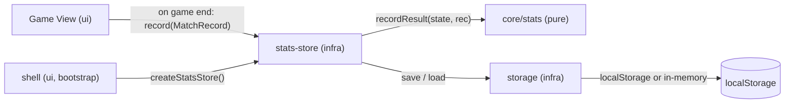

# Technical Design: FEAT-004 — Persistent stats recording

> Feature from: docs/implementation-plan.md · Epic: EPIC-STATS
> Implements: FR-STATS-001, FR-STATS-002, FR-STATS-005, FR-STATS-007; NFR-REL-002
> Realizes: UC-04 (completes — outcome recording)
> Screens: **none** (writes on game-end; the stats view is FEAT-005) → ui-design skipped
> Status: Draft · Date: 2026-08-08

## 1. Intent

Record every finished game to persistent, on-device statistics: running
win/loss/draw tallies segmented by mode (and difficulty for vs-Computer) plus an
append-only match history, written to `localStorage` at the moment a game ends
and surviving reloads. This stands up the **Storage Repository** (infra) and the
**Stats Service** (core) that the stats view (FEAT-005) and reset (FEAT-006) will
build on. It degrades gracefully when `localStorage` is unavailable
(NFR-REL-002). No new screen — the data is produced now, displayed next slice.

## 2. Codebase context

- **Client-only SPA** (ADR-001) — no API/DB. §4 below is the **persistence
  format** (the client analog of schema): JSON under a versioned `localStorage`
  key (architecture §8).
- **Module boundaries (ADR-003):** core imports nothing outward; infra may import
  core; ui imports infra/core. So: **Stats Service is pure `core/`**; the
  **Storage Repository + the store that orchestrates persistence are `infra/`**
  (infra→core allowed); the **UI calls the infra store**. This differs from
  architecture §6's sketch (which drew the Stats Service calling the Repo
  directly) — reality wins: core stays pure, the orchestration lives in infra to
  honor the ESLint boundary. **Recorded divergence (D1).**
- **Existing code:** `core/board.ts` (`GameStatus`, `Mark`), `core/game.ts`
  (`GameState`), `ui/config.ts` (`GameConfig{mode,difficulty,humanMark}`,
  `GameMode`), `ui/views/game.ts` (detects game end on each state change — the
  natural place to fire recording), `ui/shell.ts` (bootstrap — instantiates the
  store), `infra/logger.ts` (the only infra module so far; ADR-004's Storage
  Repository lands here now).
- **Tests:** Vitest (node env). `localStorage` is not in node, so the storage
  repo takes an **injectable backend** for tests (and to model the unavailable
  case). No E2E owed: FEAT-004 produces data with **no UI yet** (the stats view
  is FEAT-005 / CF-2), so there is nothing user-visible to smoke — CF-2's E2E
  lands with FEAT-005/006 (flow-aware, ADR-006). Recording is covered by unit +
  integration tests with an injected backend.

## 3. Contracts — core + infra modules

### 3.1 `core/stats.ts` (new — Stats Service, pure)

```ts
export type GameResult = "win" | "loss" | "draw"; // perspective: see D2
export interface WLD { wins: number; losses: number; draws: number; }
export interface Stats {
  twoPlayer: WLD;
  vsComputer: Record<Difficulty, WLD>; // easy | medium | hard
}
export interface MatchRecord {
  mode: GameMode;            // note: GameMode/Difficulty are re-exported from core for infra reuse (D3)
  difficulty?: Difficulty;   // vs-computer only
  result: GameResult;
  timestamp: number;         // ms epoch (injected in tests)
}
export interface StatsState {
  version: number;           // schema version guard (architecture §8)
  stats: Stats;
  history: MatchRecord[];    // append-only, newest last
}

export const STATS_VERSION: number;
export function emptyStatsState(): StatsState;

// Pure: increment the right W/L/D bucket + append the record. Returns new state.
export function recordResult(state: StatsState, record: MatchRecord): StatsState;

// Map an ended GameStatus to a result from `perspective`'s point of view.
export function resultOf(status: GameStatus, perspective: Mark): GameResult;
```

`Difficulty`/`GameMode`: `Difficulty` already lives in `core/ai.ts`. `GameMode`
currently lives in `ui/config.ts` — but a `MatchRecord` is core data that infra
persists, and core can't import ui. **D3:** move `GameMode` into `core` (re-export
from `ui/config.ts` for back-compat) so the record type is core-owned.

### 3.2 `infra/storage.ts` (new — Storage Repository, ADR-004)

```ts
export interface StorageLike { getItem(k: string): string | null; setItem(k: string, v: string): void; }
export interface StorageRepo {
  load<T>(key: string, fallback: T): T;   // parse JSON; any error/missing → fallback
  save<T>(key: string, value: T): void;   // JSON.stringify; swallow quota/availability errors
}
// backend defaults to a probed globalThis.localStorage; null → in-memory Map
// (graceful fallback, NFR-REL-002). Injectable for tests.
export function createStorageRepo(backend?: StorageLike | null): StorageRepo;
```

### 3.3 `infra/stats-store.ts` (new — orchestrates persistence)

```ts
export interface StatsStore {
  record(record: MatchRecord): StatsState; // core.recordResult → repo.save
  snapshot(): StatsState;                   // current in-memory state
}
// Loads persisted state on creation; a version mismatch or corrupt data resets
// to emptyStatsState (architecture §8 / NFR-REL-001). repo injectable for tests.
export function createStatsStore(repo?: StorageRepo): StatsStore;
```

Key: `STATS_KEY = "ttt:stats:v1"` (versioned key + `version` field — belt and
suspenders, architecture §8).

## 4. Persistence format (client "schema")

One `localStorage` entry: key `ttt:stats:v1` → JSON of `StatsState`
(`{ version, stats:{ twoPlayer, vsComputer:{easy,medium,hard} }, history:[…] }`).
On load: `JSON.parse`; if missing, unparneable, or `version !== STATS_VERSION`
→ `emptyStatsState()` (no crash). On save: `JSON.stringify` then `setItem`,
inside try/catch (quota/unavailable → no-op; the in-memory state remains
authoritative for the session — NFR-REL-002).

## 5. Component design



- **`core/stats.ts`** (new) — pure model + `recordResult` + `resultOf`.
- **`infra/storage.ts`** (new) — Storage Repository (ADR-004), injectable backend,
  graceful fallback.
- **`infra/stats-store.ts`** (new) — loads on boot, records via core, persists via
  repo.
- **`ui/shell.ts`** — `createStatsStore()` once at bootstrap; thread it to the
  game view.
- **`ui/views/game.ts`** — on the transition to a terminal status (won/draw),
  build a `MatchRecord` (perspective = `mode==="vs-computer" ? humanMark : "X"`,
  D2) and call `store.record(...)` **exactly once per game** (a `recorded` guard,
  reset on New Game — FR-STATS-007). No visual change this slice.
- **`ui/config.ts`** — re-export `GameMode` from core (D3).

## 6. Acceptance criteria

- **AC-1** (FR-STATS-001): Recording a finished game increments the correct
  W/L/D bucket — `twoPlayer` for 2-player; `vsComputer[difficulty]` for
  vs-Computer (segmented by mode and, for vs-Computer, difficulty).
- **AC-2** (FR-STATS-002): A `MatchRecord` (mode, difficulty?, result, timestamp)
  is appended to history at game end.
- **AC-3** (FR-STATS-007): Stats + history update **automatically at game end**
  (win or draw), **exactly once** per game — not on New Game, not per render, not
  on illegal input.
- **AC-4** (FR-STATS-005): Stats + history **persist to `localStorage`** and are
  **restored on the next load** (survive reload/restart).
- **AC-5** (NFR-REL-002): When `localStorage` is unavailable or `setItem`
  throws, recording still works **in-memory for the session** — no crash,
  degrades to non-persistent.
- **AC-6** (NFR-REL-001 / architecture §8): Corrupt or wrong-version stored data
  **resets to defaults** on load — no crash.

## 7. Decisions

- **D1 — Persistence orchestration lives in `infra`, not `core`.** The Stats
  Service is pure `core/stats.ts`; the `stats-store` (infra) calls it and
  persists via the Storage Repository. Driver: ADR-003 (core imports nothing
  outward) — architecture §6's sketch of "Stats Service → Repo" would violate the
  ESLint boundary. Consequence: the UI talks to the infra store; core stays
  DOM/IO-free and fully unit-testable.
- **D2 — Result perspective.** `win/loss/draw` is from the **human's** view in
  vs-Computer (win = human's mark won) and from **Player 1 (X)** in 2-player
  (X-win = win, O-win = loss). Driver: FR-STATS-001 wants a uniform W/L/D per
  bucket; 2-player has no personal "you", so P1/X is the convention. FEAT-005
  (stats view) confirms labeling; recorded here so it's explicit.
- **D3 — `GameMode` moves to `core`.** `MatchRecord` is core data persisted by
  infra; core can't import `ui/config.ts`. Move the `GameMode` type into core and
  re-export from `ui/config.ts` (no call-site churn). `Difficulty` is already core.
- **D4 — Injectable backend/repo.** `createStorageRepo(backend?)` and
  `createStatsStore(repo?)` take injectable dependencies so the graceful-fallback
  and persistence paths are unit-testable without a DOM (node Vitest).

## 8. Escalations & open items

- **None requiring escalation.** No new *conceptual* entity — Stats and Match
  History are named in the architecture's building blocks (§5) and cross-cutting
  data model (§8); this is their physical realization. The core/infra split (D1)
  is a boundary-honoring refinement of §6's sketch, recorded not escalated.
- **No E2E owed:** FEAT-004 has no user-visible surface (stats view is FEAT-005 /
  CF-2). The CF-2 E2E is minted when FEAT-005/006 make stats visible (ADR-006,
  flow-aware). Recording is covered by unit + integration tests.
- **Plan note:** FEAT-004's screen list is empty → **ui-design skipped** for this
  feature (the orchestrator proceeds straight to implementation).
