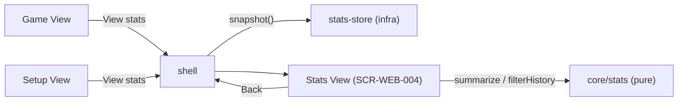

# Technical Design: FEAT-005 — Statistics & History view

> Feature from: docs/implementation-plan.md · Epic: EPIC-STATS
> Implements: FR-STATS-003, FR-STATS-004, FR-UI-002 (completes game↔stats nav)
> Realizes: UC-06 (View Statistics & History)
> Screens: SCR-WEB-004 (Statistics & History) — designed by ui-design
> Status: Draft · Date: 2026-08-08

## 1. Intent

Make the persisted stats visible: a Statistics screen showing a **W/L/D summary**
and the **chronological match history**, with a **mode filter** (All /
Vs. Computer / 2 Players), reachable from the game and back. This is the read
side of the stats the store already records (FEAT-004), and it completes
game↔stats navigation (FR-UI-002). It also makes **CF-2 "Review statistics"**
buildable, so a CF-2 E2E smoke is minted here (ADR-006). Reset lives on this
screen but is **FEAT-006** (SCR-WEB-005 dialog) — not built now.

## 2. Codebase context

- **Client-only SPA** (ADR-001) — no API/DB. The "read contract" is the stats
  store's `snapshot()` plus pure aggregation helpers in `core/stats.ts`.
- **Existing code (FEAT-004):** `core/stats.ts` (`StatsState`, `Stats`, `WLD`,
  `MatchRecord`, `GameMode`); `infra/stats-store.ts` (`createStatsStore().snapshot()`
  returns the current `StatsState`, already loaded from `localStorage`). The
  view reads via the store — **no new persistence**; FEAT-005 is read-only.
- **Existing UI:** `ui/shell.ts` routes Setup↔Game and holds the single
  `statsStore`; `ui/views/stats.ts` is still the **skeleton placeholder** —
  FEAT-005 replaces it. `ui/views/game.ts` and `ui/views/setup.ts` gain a
  "View stats" entry point. `ui/dom.ts` (`el`, `topbar`), design tokens wired.
- **Module boundaries (ADR-003):** aggregation is pure → `core/stats.ts`; the
  view is `ui/` and reads the infra store (ui→infra→core).
- **Tests:** Vitest for the core aggregation; **CF-2 E2E is now owed** (UC-06 ∈
  CF-2, and this feature makes CF-2 demonstrable) → a Playwright CF-2 smoke
  (review stats) is minted (T4, ADR-006). Reset is FEAT-006, so the CF-2 smoke
  here covers review only.

## 3. Contracts

### 3.1 `core/stats.ts` (additions — pure read helpers)

```ts
export type StatsFilter = "all" | "two-player" | "vs-computer";

// Aggregate W/L/D for the selected filter:
//   all → twoPlayer + vsComputer(easy+medium+hard); two-player → twoPlayer;
//   vs-computer → sum of the three difficulty buckets.
export function summarize(state: StatsState, filter: StatsFilter): WLD;

// History filtered by mode, newest first (history is stored append/oldest-first).
export function filterHistory(state: StatsState, filter: StatsFilter): MatchRecord[];
```

### 3.2 Read from the store

The view calls `statsStore.snapshot()` (existing) once on mount to get the
`StatsState`, then `summarize`/`filterHistory` for the active filter. No writes.

## 4. State shape

No new persisted state. UI-local: the active `StatsFilter` (default `"all"`).

## 5. Component design



- **`core/stats.ts`** — add `StatsFilter`, `summarize`, `filterHistory` (pure).
- **`ui/views/stats.ts`** (replace placeholder) — renders SCR-WEB-004: top bar
  with a **Back** control, title, **W/L/D stat-tiles** for the filter, a **mode
  filter** segmented control (All / Vs. Computer / 2 Players), and the **match
  history list** (each row: result, mode + difficulty, time). **Empty state**
  when history is empty (UC-06 2a). Re-renders on filter change from the
  in-memory snapshot. No reset control (FEAT-006).
- **`ui/shell.ts`** — add `showStats(back)`; hold the current game view element
  so **Game→Stats→Back preserves game state** (re-mount the same element, not a
  new game — D1). Thread `onViewStats` to game/setup views.
- **`ui/views/game.ts`, `ui/views/setup.ts`** — add a "View stats & history"
  footer link that calls `onViewStats` (FR-UI-002).

## 6. Acceptance criteria

- **AC-1** (FR-STATS-003, UC-06): The stats view shows a **W/L/D summary**
  (wins, losses, draws counts) for the active filter.
- **AC-2** (FR-STATS-004, UC-06): The stats view shows the **match history** as a
  chronological list; each entry shows result, mode (+ difficulty for
  vs-Computer), and time.
- **AC-3** (UC-06 2a): With **no stored games**, the view shows **zeroed counts**
  and an **empty-history** state — no crash.
- **AC-4** (FR-UI-002): The user can navigate **from the game to the stats view
  and back** (and the game is not lost on return — D1).
- **AC-5** (FR-STATS-003/004): The **mode filter** (All / Vs. Computer /
  2 Players) filters **both** the W/L/D summary and the history list.
- **AC-6** (FR-STATS-005 read path): The displayed data **reflects the persisted
  stats** — after playing games (and across reload), the view shows the stored
  tallies/history.

## 7. Decisions

- **D1 — Preserve the game across Game→Stats→Back.** The shell keeps the current
  game view element and re-mounts it on return, so in-progress/finished game
  state survives a detour to stats. Driver: FR-UI-002 + UX (viewing stats
  shouldn't discard the game). Alternative (recreate the game) rejected: it
  silently loses state. Consequence: the shell holds one game-view reference.
- **D2 — Aggregation lives in `core/stats.ts` (pure), not the view.** Driver:
  NFR-MAINT-001/002 — `summarize`/`filterHistory` are unit-tested; the view only
  renders. Consequence: display logic is testable without a DOM.
- **D3 — History shown newest-first.** `filterHistory` reverses the
  append-order (stored oldest-first) so the most recent game is on top (UC-06
  "chronological list" — most-recent-first is the useful order). Recorded so the
  test asserts the order deliberately.

## 8. Escalations & open items

- **None requiring escalation.** No new entity; the Stats View is the
  architecture's named building block (§5). Reset (SCR-WEB-005) is FEAT-006.
- **E2E owed & minted:** UC-06 ∈ CF-2, and FEAT-005 makes CF-2 demonstrable → a
  Playwright **CF-2 "review statistics"** smoke is a task (T4, ADR-006). It
  covers review + filter; the reset segment of CF-2 lands with FEAT-006.
- **Handoff:** SCR-WEB-004 → **ui-design** (it exists in the Claude Design source
  — "Stats Screen"; likely Strategy A register). Read contract above →
  implementation.
