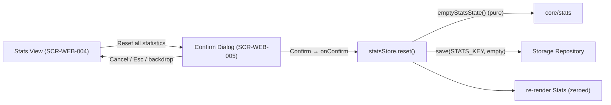

# Technical Design: FEAT-006 — Reset statistics

> Feature from: docs/implementation-plan.md · Epic: EPIC-STATS
> Implements: FR-STATS-006 (S), FR-UI-003 (S)
> Realizes: UC-07 (Reset Statistics)
> Screens: SCR-WEB-005 (Reset Confirmation — modal over SCR-WEB-004) — designed by ui-design
> Status: Draft · Date: 2026-08-09

## 1. Intent

Let the player clear all recorded statistics and match history — but never in
one tap. A **Reset all statistics** action on the Stats view (SCR-WEB-004) opens
a **confirmation dialog** (SCR-WEB-005); confirming clears the persisted stats
and re-renders the Stats view with zeroed data, cancelling changes nothing. This
is the write-to-empty counterpart of FEAT-004's recording and FEAT-005's read
view, and it completes the **CF-2 "Review & reset statistics"** critical flow —
so the CF-2 E2E smoke gains its reset segment here (ADR-006).

## 2. Codebase context

- **Client-only SPA** (ADR-001) — no API/DB. "Reset" is a write of the empty
  state through the existing store + Storage Repository (ui → infra → core,
  ADR-003).
- **Existing code the feature builds on:**
  - `core/stats.ts` — `emptyStatsState()` already returns the zeroed, versioned
    `StatsState`. **Reset reuses it; no new core needed.**
  - `infra/stats-store.ts` — `createStatsStore()` exposes `record()` /
    `snapshot()` and owns the single session `state` + `repo.save(STATS_KEY, …)`.
    **Needs one new method: `reset()`.**
  - `infra/storage.ts` — `StorageRepo.save/load`; `save` already persists JSON
    under `STATS_KEY` and degrades gracefully (NFR-REL-002). **No change** —
    reset persists by `save`-ing the empty state, not by removing the key (D3).
  - `ui/views/stats.ts` (FEAT-005) — renders SCR-WEB-004. It holds an immutable
    `const state = statsStore.snapshot()` captured on mount and re-renders from
    it on filter change. **Reset must re-read the snapshot after clearing** (the
    view currently never re-reads) — see D1.
  - `ui/dom.ts` — `el()` helper, shared top-bar pieces. No dialog primitive yet.
- **No modal exists anywhere in the app** — SCR-WEB-005 is the first. The design
  system already specifies it in prose (design.md §4 "confirmation dialog", §9
  known gap): modal over a scrim, `--surface` panel radius 18px `--shadow`,
  title + body, a **danger + ghost** button pair, focus-trapped, **Esc cancels**.
- **Tests:** Vitest for the store's `reset()`; the existing
  `infra/stats-store.test.ts` is the home for it. `tests/e2e/review-stats.spec.ts`
  is the CF-2 smoke and explicitly notes "Reset … is FEAT-006" — extend it (D4).

## 3. Contracts

### 3.1 `infra/stats-store.ts` — add `reset()`

```ts
export interface StatsStore {
  record(record: MatchRecord): StatsState;
  snapshot(): StatsState;
  reset(): StatsState; // NEW — clear all stats + history, persist, return empty state
}
```

Behavior: set the session `state = emptyStatsState()` (pure core), persist it
with `repo.save(STATS_KEY, state)`, and return it. After reset, `snapshot()`
returns the zeroed state and a fresh store over the same backend loads zeroed
data (FR-STATS-006, UC-07.4; persistence per NFR-REL-002).

### 3.2 `ui/views/confirm-dialog.ts` — new reusable confirm dialog (SCR-WEB-005)

```ts
export interface ConfirmDialogOptions {
  title: string;        // e.g. "Reset all statistics?"
  body: string;         // consequence copy, e.g. "This permanently clears…"
  confirmLabel: string; // danger button, e.g. "Reset statistics"
  cancelLabel?: string; // ghost button, default "Cancel"
  onConfirm: () => void; // invoked once, on confirm, before the dialog closes
}

// Opens a modal confirmation. Returns a handle to open/close programmatically.
// Cancel path (ghost button, Esc, or backdrop) closes without calling onConfirm.
export function openConfirmDialog(opts: ConfirmDialogOptions): void;
```

Implemented with the native `<dialog>` element via `showModal()` (D2): the
browser provides the scrim (`::backdrop`), the focus trap, and the
Esc→`cancel` event for free — satisfying design.md §4 "focus-trapped, Esc
cancels" with minimal manual code and correct `role="dialog"`/`aria-modal`
semantics. The danger/ghost button pair, panel radius, and colors come from
design.md §4 / tokens; **exact visuals are ui-design's output** (SCR-WEB-005).

### 3.3 `ui/views/stats.ts` — add the reset control + wire the dialog

The Stats view gains a **danger "Reset all statistics"** control (placed per
SCR-WEB-005 / ui-design — footer of the stats panel). Activating it calls
`openConfirmDialog({ …, onConfirm: doReset })`. `doReset` calls
`statsStore.reset()`, refreshes the view's snapshot, and re-renders (zeroed
tiles + empty history). No reset control shows when there is nothing to
clear is **not** required (UC-07 has no such precondition); the control is
always present, and confirming on empty stats is a harmless no-op re-render.

## 4. State shape

No new persisted shape. Reset **writes the existing `StatsState` at its current
version, zeroed** (`emptyStatsState()`), under the existing `STATS_KEY`. The
schema-version guard (FEAT-004) is preserved — the key stays valid, not removed.

## 5. Component design



- **`infra/stats-store.ts`** — add `reset()` (§3.1). The only new logic.
- **`ui/views/confirm-dialog.ts`** (new) — the reusable modal (§3.2).
- **`ui/views/stats.ts`** — add the danger control + `doReset` (§3.3); make the
  snapshot re-readable so the post-reset re-render shows zeroed data (D1).
- **`src/style.css`** — dialog + danger-button styles from tokens (ui-design
  finalizes; the CSS lives here per the project's single-stylesheet convention).

## 6. Acceptance criteria

- **AC-1** (FR-STATS-006, UC-07.1): The Stats view presents a **Reset all
  statistics** action.
- **AC-2** (FR-UI-003, UC-07.2): Activating reset opens a **confirmation dialog**
  **before any data changes** — no stats are cleared on the first tap.
- **AC-3** (FR-STATS-006, UC-07.3–4): **Confirming** clears all stats and history
  and the view shows **zeroed data** (all tiles `0`, empty-history state).
- **AC-4** (UC-07 3a, FR-UI-003): **Cancelling** — via the cancel button, **Esc**,
  or the backdrop — makes **no change**; the previous stats/history remain.
- **AC-5** (FR-STATS-006 persistence; NFR-REL-002): After a confirmed reset, the
  cleared state **persists** — a reload / fresh store over the same storage shows
  zeroed data (reset writes `emptyStatsState()` to `STATS_KEY`).
- **AC-6** (FR-UI-003; design.md §4/§5 a11y): The dialog is **focus-trapped**,
  **Esc cancels**, and the destructive action is conveyed by label, **not colour
  alone** (best-effort a11y bar, NFR-USE-003).

## 7. Decisions

- **D1 — Stats view re-reads its snapshot after reset.** FEAT-005 captured
  `const state = snapshot()` once on mount (fine when the view was read-only).
  Reset mutates the store mid-view, so the reset path must re-read
  `statsStore.snapshot()` and re-render from the fresh (zeroed) state. Driver:
  AC-3 (view must show zeroed data). Consequence: `state` becomes a reassignable
  `let` refreshed in `doReset`; the filter-change render is unchanged.
- **D2 — Native `<dialog>` + `showModal()` for SCR-WEB-005.** Gives the scrim,
  focus trap, Esc-cancel, and modal ARIA semantics natively — meeting design.md
  §4's requirements with far less code than a hand-rolled overlay + key handler.
  Driver: AC-6 + NFR-MAINT-001 (keep the manual-DOM UI thin). Note: this is the
  HTML `<dialog>` element, **not** `window.confirm()` — no blocking JS dialog.
- **D3 — Reset writes `emptyStatsState()`; it does not remove the key.** Writing
  the zeroed, versioned state keeps `STATS_KEY` valid and the FEAT-004 version
  guard intact, and directly yields "show zeroed data" (UC-07.4). Removing the
  key would rely on load-time fallback and drop the version marker. Driver:
  reuse FEAT-004's persistence contract unchanged. Consequence: no new method on
  `StorageRepo` (no `remove`) is needed.
- **D4 — Reset completes the CF-2 E2E smoke.** UC-07 ∈ CF-2; FEAT-005 minted the
  review half and flagged reset as owed to FEAT-006. Extend
  `tests/e2e/review-stats.spec.ts` with the reset segment (confirm clears; cancel
  is a no-op) rather than a new spec file — CF-2 is one flow. Driver: ADR-006
  (flow-aware E2E per feature that completes a CF segment).

## 8. Escalations & open items

- **None requiring escalation.** No new entity, no boundary change — `reset()` is
  a method on the architecture's named Stats Service / Storage Repository blocks,
  writing the existing entity zeroed. The confirm dialog is a UI component, not a
  domain concept.
- **E2E owed & minted:** CF-2 reset segment → task in tasks.md (D4, ADR-006).
- **Handoff:** SCR-WEB-005 → **ui-design** (design.md §9 lists it as a
  not-yet-mocked known gap — ui-design specifies it against the §4 dialog prose
  and tokens; likely Strategy generate/code-native, not a registered Figma
  screen). Contracts §3 → implementation via tasks.md.
</content>
</invoke>
