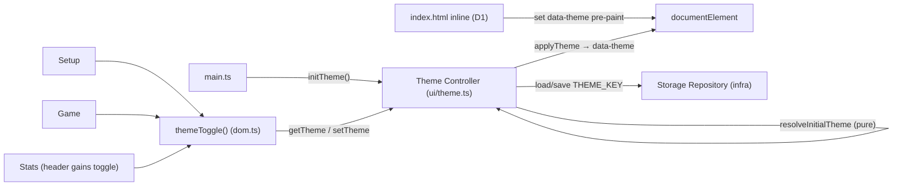

# Technical Design: FEAT-007 — Light/dark theming

> Feature from: docs/implementation-plan.md · Epic: EPIC-SHELL
> Implements: FR-THEME-001 (M), FR-THEME-002 (S), FR-THEME-003 (S)
> Realizes: UC-08 (Change Theme)
> Screens: no new SCR — the **global theme toggle** present on every screen
> (SCR-WEB-001/002/003/004 headers) — designed by ui-design
> Status: Draft · Date: 2026-08-10

## 1. Intent

Turn the placeholder theme toggle into a real, persistent Theme Controller: the
toggle switches light↔dark **instantly** (FR-THEME-001), the app **defaults to the
OS `prefers-color-scheme`** on first load (FR-THEME-002, SI-2), and the user's
choice **persists** across reloads and wins over the OS default thereafter
(FR-THEME-003). The dark palette already exists (tokens.json `colorDark`); this
feature is the *control + persistence + correct first-paint*, not new colors.

## 2. Codebase context

- **Client-only SPA** (ADR-001); persisted theme is UI-shell state, not a domain
  entity. Architecture §5 places the **Theme Controller** under the UI Shell,
  reading the OS default and persisting via the **Storage Repository**
  (ThemeCtl → Store). Architecture §8 marks the theme toggle **deliberately not a
  critical flow** (cosmetic) — so **no CF E2E is owed**; a small feature E2E is
  still worth its cost (persistence-across-reload isn't unit-testable).
- **Existing code:**
  - `src/ui/dom.ts` `themeToggle()` — **FEAT-001 stub**: reads `data-theme`,
    flips it on click, **no persistence, no OS default**. This feature replaces
    its behavior (routes through the Theme Controller).
  - `topbar()` (dom.ts) hosts the toggle and is used by `setup.ts` + `game.ts`.
    **`stats.ts` builds its own header** (`wordmark()` + Back) and **omits the
    toggle** — a gap: the toggle must be global (plan: "present on every screen").
  - `src/infra/storage.ts` `createStorageRepo()` — versioned-key JSON store with
    graceful in-memory fallback (NFR-REL-002). Reused for the theme key. ui→infra
    is allowed (ADR-003).
  - `src/ui/generated/tokens.css` — already emits dark values under both
    `:root[data-theme="dark"]` **and** `@media (prefers-color-scheme: dark)
    :root:not([data-theme="light"])`. Consequence: OS-default dark works with **no
    attribute**, but an explicit choice must set `data-theme` to win — and to keep
    the toggle's `.on` state honest.
  - `index.html` — has `<meta name="color-scheme" content="light dark">`; no theme
    script yet.
- **Persistence convention:** versioned keys (`ttt:stats:v1`). Theme key:
  **`ttt:theme:v1`**. Architecture §5 already lists "theme/settings" as persisted
  JSON under versioned keys — **within the conceptual model; no new entity.**

## 3. Contracts

### 3.1 `ui/theme.ts` — Theme Controller (new)

```ts
export type Theme = "light" | "dark";
export const THEME_KEY = "ttt:theme:v1";

// Pure — an explicit saved choice wins over the OS default (FR-THEME-002/003).
// Unit-tested (NFR-MAINT-002); the DOM/matchMedia/storage edges stay thin.
export function resolveInitialTheme(saved: Theme | null, prefersDark: boolean): Theme;

// Module singleton controller (UI-shell glue over the Storage Repository):
export function initTheme(): void;            // resolve + apply + seed `current` on boot
export function getTheme(): Theme;            // current applied theme
export function setTheme(theme: Theme): void; // apply (data-theme) + persist (FR-THEME-001/003)
```

- `initTheme()` — `resolveInitialTheme(repo.load(THEME_KEY, null), matchMedia("(prefers-color-scheme: dark)").matches)`, then `applyTheme` + record `current`.
- `setTheme(t)` — `applyTheme(t)` (set `data-theme` on `documentElement`) + `repo.save(THEME_KEY, t)` (graceful).
- `applyTheme` (private) — `documentElement.setAttribute("data-theme", theme)`.

### 3.2 `ui/dom.ts` `themeToggle()` — route through the controller

Replace the stub's inline attribute-flip: on build, read `getTheme()` for the
active `.on` state; on click, call `setTheme("light"|"dark")` and update the
`.on` classes. No behavior change to markup/classes (design.md `.toggle`).

### 3.3 `index.html` — anti-FOUC init (D1)

A tiny dependency-free `<script>` in `<head>` sets `data-theme` **before first
paint** from the same key/logic, so a persisted non-OS choice (e.g. dark on a
light-OS machine) doesn't flash the OS theme first. Runtime source of truth
stays `ui/theme.ts`; the snippet is a documented contract duplicate (D1).

## 4. State shape

New persisted key **`ttt:theme:v1`** → a JSON string `"light"` | `"dark"`
(written via `StorageRepo.save`, i.e. `JSON.stringify`). No schema/versioned
object — a bare string is sufficient; corrupt/absent → treated as "no saved
choice" → OS default (`resolveInitialTheme` returns the OS branch for any value
that isn't exactly `"light"`/`"dark"`).

## 5. Component design



- **`ui/theme.ts`** (new) — Theme Controller + pure `resolveInitialTheme`.
- **`main.ts`** — call `initTheme()` before `mountShell()`.
- **`ui/dom.ts`** — `themeToggle()` routes through the controller (§3.2).
- **`ui/views/stats.ts`** — add the toggle to the stats header (global presence).
- **`index.html`** — inline anti-FOUC init (§3.3).

## 6. Acceptance criteria

- **AC-1** (FR-THEME-001, UC-08.1–2): Activating the theme toggle switches
  light↔dark and the new theme **applies immediately** (`data-theme` flips; colors
  change without reload).
- **AC-2** (FR-THEME-001, plan "every screen"): The theme toggle is **present on
  every screen** — Setup, Game, and Stats.
- **AC-3** (FR-THEME-002, UC-08 0a): On first load with **no saved choice**, the
  theme **defaults to the OS `prefers-color-scheme`**.
- **AC-4** (FR-THEME-003, UC-08.3): A chosen theme **persists across reload**
  (`localStorage` `ttt:theme:v1`) and is re-applied on next load.
- **AC-5** (FR-THEME-002/003): An **explicit choice wins over the OS preference**
  — `resolveInitialTheme("light", prefersDark=true) === "light"`; a non-value
  (`null`/corrupt) yields the OS branch.
- **AC-6** (NFR-REL-002): With `localStorage` unavailable, theming still works
  for the session (apply succeeds; persistence silently no-ops) — **no crash**.

## 7. Decisions

- **D1 — Anti-FOUC inline `<head>` script.** Because tokens.css applies OS dark
  by default, a persisted choice that differs from the OS would flash the OS
  theme before the module runs. A dependency-free inline snippet sets
  `data-theme` pre-paint. Driver: FR-THEME-001/002 quality (correct first paint
  + honest toggle state). Cost: the snippet duplicates the key + resolution in
  raw JS (it cannot import the module synchronously in `<head>`); recorded as a
  **documented contract**, with `ui/theme.ts` remaining the runtime source of
  truth. Alternative (module-only init) rejected: visible flash for the common
  "chose dark on a light-OS machine" case.
- **D2 — Bare string value, not a versioned object.** Theme is one enum; a
  version guard buys nothing (any non-`light`/`dark` value already falls back to
  OS). Driver: simplicity. Consequence: `resolveInitialTheme` is total over
  arbitrary input.
- **D3 — Theme Controller is a UI-shell module using the Storage Repository
  directly** (`ui/theme.ts` → `infra/storage.ts`), not a new `infra` store.
  Driver: architecture §5 places ThemeCtl in the UI Shell (ThemeCtl → Store);
  the persisted value is trivial. Pure `resolveInitialTheme` is the unit-tested
  seam; DOM/matchMedia/storage stay thin and are E2E-covered. ui→infra is
  boundary-legal (ADR-003).

## 8. Escalations & open items

- **None requiring escalation.** No new entity (architecture §5 already lists
  persisted theme/settings); no boundary change (ui→infra is legal); no new
  color (dark palette exists). The Theme Controller is a named architecture block.
- **No CF E2E owed** (architecture §8: theme is explicitly not a critical flow).
  A small **feature-level `theme.spec.ts`** is still minted (T4) — toggle applies,
  persists across reload, present on screens — because reload-persistence is not
  unit-testable.
- **Handoff:** the global toggle placement → **ui-design** (the `.toggle`
  component already exists in design.md §4; the work is confirming it on every
  screen header and adding it to the Stats header). Contracts §3 → implementation.
</content>
