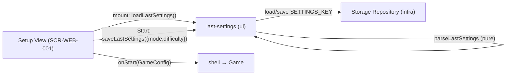

# Technical Design: FEAT-008 — Remember last mode/difficulty

> Feature from: docs/implementation-plan.md · Epic: EPIC-SHELL · **Priority: Could**
> Implements: FR-MODE-005 (C)
> Realizes: UC-01 (alt flow 2a — accept remembered settings and start)
> Screens: SCR-WEB-001 (Setup) — remembered-defaults state — designed by ui-design
> Status: Draft · Date: 2026-08-10

## 1. Intent

Default the Setup screen to the **most recently used mode and difficulty** on next
launch (FR-MODE-005), so a returning player can accept the remembered settings and
start immediately (UC-01 2a). The last-used settings are written at game start and
read when Setup mounts; absent/corrupt data falls back to the built-in defaults.
This is the plan's final slice — the lone **Could**.

## 2. Codebase context

- **Client-only SPA** (ADR-001); last-used settings are UI-shell preference state,
  not a domain entity. Architecture §5/§8 already lists "theme/**settings**"
  written as JSON under versioned keys — **within the conceptual model; no new
  entity, no escalation.**
- **Existing code:**
  - `src/ui/views/setup.ts` — initializes `mode = "two-player"`, `difficulty =
    "medium"`, `humanMark = "X"` as **hardcoded** defaults, and builds the
    `GameConfig` on Start. FEAT-008 seeds `mode`/`difficulty` from persisted
    last-used instead, and persists on Start.
  - `src/ui/config.ts` — `GameConfig { mode, difficulty?, humanMark? }`;
    re-exports `GameMode`. `Difficulty = "easy" | "medium" | "hard"` (core).
  - `src/infra/storage.ts` — `createStorageRepo()`, versioned-key JSON store with
    graceful in-memory fallback (NFR-REL-002). Reused for the settings key.
  - **Precedent — `src/ui/theme.ts` (FEAT-007):** a `ui/` preference module over
    the Storage Repository with a **pure resolver** unit-tested (`resolveInitialTheme`).
    FEAT-008 mirrors this shape exactly (a pure `parseLastSettings`).
- **Persistence convention:** versioned keys (`ttt:stats:v1`, `ttt:theme:v1`).
  Settings key: **`ttt:settings:v1`**.
- **Scope (FR-MODE-005 wording):** "mode **and difficulty**." `humanMark` (side)
  is **not** in FR-MODE-005 — out of scope; it stays defaulted to `X` (D2).

## 3. Contracts

### 3.1 `ui/last-settings.ts` — last-used settings (new)

```ts
import type { GameMode } from "./config.ts";
import type { Difficulty } from "../core/index.ts";

export interface LastSettings {
  mode: GameMode;         // "two-player" | "vs-computer"
  difficulty: Difficulty; // "easy" | "medium" | "hard"
}
export const SETTINGS_KEY = "ttt:settings:v1";

// Pure — validate an arbitrary loaded blob into LastSettings, or null if
// unusable (missing/corrupt/unknown enum). Unit-tested (NFR-MAINT-002).
export function parseLastSettings(raw: unknown): LastSettings | null;

export function loadLastSettings(): LastSettings | null; // via StorageRepo + parse
export function saveLastSettings(s: LastSettings): void;  // via StorageRepo (graceful)
```

`parseLastSettings` accepts only `mode ∈ {two-player, vs-computer}` and
`difficulty ∈ {easy, medium, hard}`; anything else → `null` (→ built-in defaults).

### 3.2 `ui/views/setup.ts` — seed defaults + persist on start

On mount: `const remembered = loadLastSettings();` initialize
`mode = remembered?.mode ?? "two-player"` and
`difficulty = remembered?.difficulty ?? "medium"` (humanMark unchanged, D2).
On Start (before `onStart`): `saveLastSettings({ mode, difficulty })` — persist the
current selection regardless of mode (so difficulty is remembered even if the last
game was two-player).

## 4. State shape

New persisted key **`ttt:settings:v1`** → JSON `{ "mode", "difficulty" }`. Bare
object, no schema version guard — `parseLastSettings` is total over arbitrary
input and returns `null` for anything invalid (→ defaults), which subsumes a
version mismatch (D3, same rationale as FEAT-007 D2).

## 5. Component design



- **`ui/last-settings.ts`** (new) — `LastSettings`, `SETTINGS_KEY`, pure
  `parseLastSettings`, `loadLastSettings`/`saveLastSettings`.
- **`ui/views/setup.ts`** — seed `mode`/`difficulty` from remembered; save on Start.

## 6. Acceptance criteria

- **AC-1** (FR-MODE-005, UC-01 2a): After starting a game with a chosen mode and
  difficulty, the **next mount of the Setup screen defaults to that mode and
  difficulty** (selections pre-filled).
- **AC-2** (FR-MODE-005): The remembered settings **persist across reload**
  (`localStorage` `ttt:settings:v1`) — a fresh page load still defaults to them.
- **AC-3** (FR-MODE-005; NFR-REL-002): With **no saved settings** (first launch)
  or **corrupt/unknown** data, Setup falls back to the **built-in defaults**
  (two-player, medium) — no crash.
- **AC-4** (UC-01 2a): The player can **accept the remembered settings and start
  immediately** — pressing Start without changing anything produces a game with
  the remembered mode/difficulty.

## 7. Decisions

- **D1 — Persist at game start, not on every field change.** "Most recently
  **used**" = the settings a game was actually started with. Driver: FR-MODE-005
  wording ("recently used"). Consequence: abandoning Setup without starting
  doesn't change the remembered settings.
- **D2 — Remember mode + difficulty only; not side (`humanMark`).** FR-MODE-005
  names "mode and difficulty." Side stays defaulted to `X` (goes first). Driver:
  scope discipline — implement the FR as written. Trivial to extend later if a
  new FR asks.
- **D3 — Bare object, no version guard.** `parseLastSettings` rejects any invalid
  shape/enum → defaults, which already covers a future schema change. Driver:
  simplicity (mirrors FEAT-007 D2). Consequence: a format change just invalidates
  old data into a safe fallback.

## 8. Escalations & open items

- **None requiring escalation.** No new entity (architecture already lists
  persisted settings); no boundary change (ui→infra is legal, ADR-003); no new
  screen (Setup gains a *remembered-defaults* state on SCR-WEB-001, closing the
  manifest gap).
- **No CF E2E owed** — FR-MODE-005 is a Could refinement of the existing UC-01
  setup flow (already covered by CF-1). A small **feature E2E** is still minted
  (T3) — remembered-across-reload isn't unit-testable.
- **Handoff:** SCR-WEB-001 remembered-defaults state → **ui-design** (closes the
  manifest's `remembered-defaults → FEAT-008` gap; no new component). Contracts §3
  → implementation.
</content>
