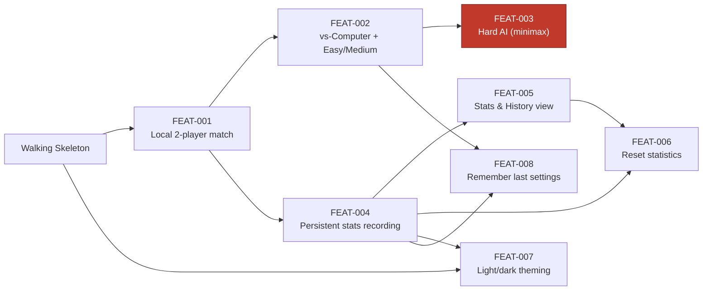
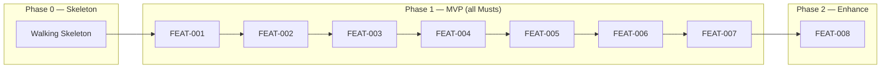

# Implementation Plan: Tic-Tac-Toe Game

> Status: Draft · Last updated: 2026-07-14
> Inputs: docs/srs.md · docs/use-cases.md · docs/architecture.md ·
> docs/ux-foundations.md (+ docs/design.md, docs/tokens.json, docs/rtm.md) —
> **all found; full fidelity.**

## 1. Overview

This plan turns the finalized SRS and the architecture/UX design into an
executable build order for a client-side, single-page Tic-Tac-Toe SPA (Vanilla
TypeScript + Vite, no backend — ADR-001/002). The system is one deployable
static bundle organized as a **pure domain core** (Game Engine, AI, Stats) with
a thin **UI Shell** depending inward (ADR-003), plus a **Storage Repository**
over `localStorage` (ADR-004).

**Ordering priority (confirmed):** *de-risk the core first.* After a walking
skeleton proves the pipeline, we build the pure, unit-tested domain core (engine
→ win/draw → AI, culminating in the Hard **minimax** guarantee) before layering
persistence, stats UI, and theming. This front-loads the only genuine technical
risk (minimax must *never lose* within 500 ms — FR-AI-003 / NFR-PERF-002) and
validates the layered architecture — the SRS's top quality goal (NFR-MAINT-001/
002) — while change is cheapest.

**MVP cut line:** every **Must**-priority FR. Should-priority items are folded
into the MVP slices where cheap; the one Could item (FR-MODE-005) is the last
slice. **No fixed deadline** — the sequence is a build order, not a schedule;
phases beyond the near term are a living order (§7).

## 2. Walking Skeleton

The thinnest end-to-end path that proves the system runs *and deploys*, giving
every later slice a place to attach.

- **What's real:**
  - Vite + TypeScript project; `tokens.json` wired into CSS custom properties
    and `design.md`'s single 460px centered column + top bar shell.
  - `main.ts` bootstrap with a minimal view-switch (Setup ↔ Game ↔ Stats
    placeholders) — the navigation frame (FR-UI-002 scaffold).
  - One trivial end-to-end operation: the Game view renders an **empty 3×3
    board** (FR-GAME-001, partial) and a click on a cell places a static mark
    via a minimal `applyMove` placement call into the core — proving UI → core
    → re-render works.
  - `vite build` produces a static bundle; a **deploy config** (GitHub Pages /
    Netlify) is written and the bundle deploys; **Vitest** runs one trivial core
    test green in **CI**.
- **What's stubbed:** win/draw detection, turn alternation, AI, stats
  persistence, theme persistence, the real Setup and Stats screens.
- **Done when:** a cell click flows UI → core → re-render in a *deployed* static
  environment, the design tokens are live in light/dark base, and the CI
  pipeline (build + one unit test) is green.

## 3. Epic & Feature Breakdown

Four epics, each aligned to architecture building blocks (§5 of architecture.md).
Feature IDs are minted here in definition order and are **immutable** — the build
sequence (§4), dependency graph, and RTM Plan ref key on them.

### EPIC-GAME — Core Gameplay  *(Game Engine + Setup/Game/Result views)*

| ID | Feature | FRs | UCs | Screens | Blocks / Endpoints | Data |
| :- | :------ | :-- | :-- | :------ | :----------------- | :--- |
| FEAT-001 | **Local two-player match** — full playable game between two humans on one device: place marks, alternate turns (X first), reject illegal/after-end input, detect win + highlight line, detect draw, announce result, New Game / return to setup. | FR-GAME-001..011, FR-GAME-012(S), FR-GAME-008(S); FR-MODE-001(partial), FR-MODE-004(partial) | UC-01(partial), UC-02, UC-04(partial — result only), UC-05 | SCR-WEB-001 (2-player path), SCR-WEB-002, SCR-WEB-003 | Game Engine (`applyMove`, turn mgmt, win/draw); Setup View, Game View | In-memory game state (no persistence) |

### EPIC-AI — Computer Opponent  *(AI Module + vs-Computer flow)*

| ID | Feature | FRs | UCs | Screens | Blocks / Endpoints | Data |
| :- | :------ | :-- | :-- | :------ | :----------------- | :--- |
| FEAT-002 | **vs-Computer setup + Easy/Medium AI** — choose vs-Computer mode, difficulty, and side; AI auto-moves after a brief delay on its turn; Easy = random legal, Medium = win/block-else-random; only legal moves. Completes mode selection. | FR-MODE-002, FR-MODE-003(S); FR-AI-001, FR-AI-002, FR-AI-004, FR-AI-005; FR-MODE-001(complete), FR-MODE-004(complete) | UC-01(complete), UC-03(easy/medium) | SCR-WEB-001 (vs-computer path: difficulty + side), SCR-WEB-002 (computer-thinking state) | AI Module (easy, medium); Setup View, Game View | none |
| FEAT-003 | **Hard AI (minimax)** — optimal play that never loses, dropped into the existing Hard difficulty slot; within the 500 ms budget. *(Highest technical risk.)* | FR-AI-003 | UC-03(hard) | SCR-WEB-002 (no new UI) | AI Module (minimax) → Game Engine (legal moves) | none |

### EPIC-STATS — Statistics & Persistence  *(Stats Service + Storage Repository + Stats/Reset views)*

| ID | Feature | FRs | UCs | Screens | Blocks / Endpoints | Data |
| :- | :------ | :-- | :-- | :------ | :----------------- | :--- |
| FEAT-004 | **Persistent stats recording** — stand up the Storage Repository (versioned JSON keys, graceful in-memory fallback when `localStorage` is unavailable) and the Stats Service; record W/L/D + a match-history entry (result, mode, difficulty, timestamp) at game end, persisted. | FR-STATS-001, FR-STATS-002, FR-STATS-005, FR-STATS-007; NFR-REL-002 | UC-04(complete — recording) | — (writes on game-end from SCR-WEB-003) | Stats Service; Storage Repository (`localStorage` adapter) | Stats tallies, history array (write) |
| FEAT-005 | **Statistics & History view** — W/L/D summary tiles, mode filter (All / Vs. Computer / 2-Player), chronological match list; empty-state handling; navigation game ↔ stats. | FR-STATS-003, FR-STATS-004; FR-UI-002(complete) | UC-06 | SCR-WEB-004 | Stats View; Stats Service (read); Storage Repository (read) | Stats, history (read) |
| FEAT-006 | **Reset statistics** — confirmation dialog before clearing all stats/history, then clear and show zeroed data; cancel is a no-op. | FR-STATS-006(S); FR-UI-003(S) | UC-07 | SCR-WEB-005 (modal over SCR-WEB-004) | Stats View; Storage Repository (clear) | Stats, history (clear) |

### EPIC-SHELL — Shell & Theming  *(UI Shell / main.ts + Theme Controller)*

| ID | Feature | FRs | UCs | Screens | Blocks / Endpoints | Data |
| :- | :------ | :-- | :-- | :------ | :----------------- | :--- |
| FEAT-007 | **Light/dark theming** — global theme toggle applies instantly; default to OS `prefers-color-scheme` on first load; persist the choice. | FR-THEME-001; FR-THEME-002(S), FR-THEME-003(S) | UC-08 | Global toggle (present on every screen) | Theme Controller; Storage Repository (persist); `prefers-color-scheme` (SI-2) | Theme preference |
| FEAT-008 | **Remember last mode/difficulty** — default the Setup screen to the most recently used mode and difficulty on next launch. *(Could — last.)* | FR-MODE-005(C) | UC-01 (alt flow 2a) | SCR-WEB-001 | Setup View; Storage Repository | Last-used settings |

**Cross-cutting placements (not a slice):** FR-UI-001 (responsive 320px→desktop)
and the accessibility bar (NFR-USE-002/003, NFR-A11Y-001) are the responsive
layout + design-system setup — **placed in Engineering Foundations (§6)** and
honored by every view slice. The navigation *frame* is stood up in the skeleton;
FR-UI-002 completes at FEAT-005 (game ↔ stats).

### Coverage check

- **Every Must-priority FR is sliced or placed** — GAME-001..007,009,010,011 →
  FEAT-001; MODE-001/002/004 → FEAT-001/002; AI-001/002/004/005 → FEAT-002;
  AI-003 → FEAT-003; STATS-001/002/005/007 → FEAT-004; STATS-003/004 → FEAT-005;
  THEME-001 → FEAT-007; UI-001 → Foundations; UI-002 → FEAT-005. **No Must FR
  unaccounted for.**
- **Every inventory screen is touched** — SCR-WEB-001 (FEAT-001/002), -002
  (FEAT-001/002), -003 (FEAT-001), -004 (FEAT-005), -005 (FEAT-006).
- **Should/Could** — GAME-008/012, MODE-003, STATS-006, UI-003, THEME-002/003
  folded into MVP slices; MODE-005 → FEAT-008.
- **No open gaps.** No tombstoned FRs/screens exist (SRS §6 lists none), so none
  spawned a slice.

## 4. Build Sequence

Ordered by **dependency**, with **risk pulled forward** (de-risk-the-core
priority), MoSCoW as tiebreaker. One straight sequence — the app is small enough
not to need parallel tracks.

1. **Walking Skeleton** — pipeline + shell + tokens + empty board (§2).
2. **FEAT-001 — Local two-player match** *(first slice, §5)*. Most foundational
   *and* de-risks the primary quality goal: it forces the pure Game Engine
   (immutable board, legal moves, win/draw) into existence, unit-tested per
   NFR-MAINT-002. Everything else sits on this engine.
3. **FEAT-002 — vs-Computer + Easy/Medium AI**. Needs the engine and Game View
   from FEAT-001; builds the AI dispatch + auto-move harness (delay, side
   choice) that FEAT-003 plugs into.
4. **FEAT-003 — Hard AI (minimax)** — **highest risk**, pulled as early as its
   dependencies allow. The pure minimax algorithm can be *developed and
   unit-tested against the engine in parallel with FEAT-002* (it needs only the
   engine's legal-move generation); FEAT-002's harness is what surfaces it in
   the UI. Failing here (never-lose or the 500 ms budget) forces rethinking the
   core — so we want it broken in week two, not month four.
5. **FEAT-004 — Persistent stats recording**. Stands up the Storage Repository
   (shared infra) + Stats Service; needs FEAT-001's game-end events.
6. **FEAT-005 — Statistics & History view**. Needs the Stats Service + data from
   FEAT-004; completes game ↔ stats navigation (FR-UI-002).
7. **FEAT-006 — Reset statistics**. Needs the Stats view (FEAT-005) to host it
   and the repository's clear path (FEAT-004).
8. **FEAT-007 — Light/dark theming**. The Must toggle needs only the skeleton
   shell; the Should persistence reuses FEAT-004's Storage Repository.
9. **FEAT-008 — Remember last mode/difficulty** *(Could)*. Needs mode/difficulty
   (FEAT-002) + the repository (FEAT-004). Last.

**Phase view** — Phase 0 skeleton; Phase 1 is the MVP (all Musts + folded
Shoulds); Phase 2 is the lone Could + polish.

## 5. First Vertical Slice — FEAT-001: Local two-player match

**User flow it exercises & why chosen.** A complete human-vs-human game on one
device: open app → pick 2-player → play alternating moves → reach a win or draw
→ see the result → New Game (UC-01 partial, UC-02, UC-04 result, UC-05). Chosen
because it is the smallest fully *demonstrable* game (a real, winnable match) and
it forces the pure Game Engine — immutable board, legal-move validation, win/draw
detection — into existence with unit tests. That directly validates the
architecture's top quality goal (logic decoupled from the DOM, testable in
isolation — NFR-MAINT-001/002), the seam everything else depends on.

**Acceptance criteria** (from the FRs' statements and UC-02/04 flows):
- A 3×3 grid of nine selectable cells renders (FR-GAME-001).
- Tapping/clicking an empty cell places the active player's mark; X moves first;
  turns alternate X↔O (FR-GAME-002, -005).
- Clicks on an occupied cell, or any click after the game has ended, are ignored
  (FR-GAME-003, -004).
- The current turn is always visibly indicated by text, not color alone
  (FR-GAME-006; NFR-USE-003).
- Three in a row/column/diagonal is detected as a win, the winning line is
  highlighted, and the winner is announced (FR-GAME-007, -008, -010).
- A full board with no line is detected and announced as a draw (FR-GAME-009,
  -010).
- "New Game" clears the board and starts fresh with X to move; a control returns
  to Setup to change mode (FR-GAME-011, -012).
- The board renders the human move within 100 ms (NFR-PERF-001); rapid/duplicate
  input never corrupts state (NFR-REL-001).

**Screens it renders → hand off to `ui-design`:** **SCR-WEB-001** (2-player
path — mode choice, no difficulty), **SCR-WEB-002** (Game — In Play),
**SCR-WEB-003** (Game — Result: win X/O and the neutral **draw** variant, plus
winning-line highlight). *These SCR IDs are the input to the per-slice
**ui-design** step.*

**Endpoints / data / contract needs → hand off to `detailed-design`:** No
network endpoints (client-only). The **detailed-design** step defines the Game
Engine's contract: the immutable board representation, `applyMove(board, cell,
mark)` and its return (`{ board', status }` where status ∈ in-progress / won
(+winning line) / draw), turn-management and legal-move rules, and the pure
win/draw detection function. Game state is in-memory for this slice (persistence
arrives in FEAT-004). *This contract list is the input to the per-slice
**detailed-design** step.*

## 6. Engineering Foundations

Stand these up alongside the walking skeleton (derived from architecture §8
cross-cutting concepts and ux-foundations §A4/§A3):

- **Repo & conventions** — single Vite + TypeScript repo; `core/` (pure, no DOM)
  vs. `ui/` (DOM shell) vs. `infra/` (Storage Repository) directory seam
  enforcing the inward dependency rule (ADR-003, NFR-MAINT-001).
- **CI/CD** — CI runs `vite build` + `vitest`; deploy the static bundle to the
  chosen static host (GitHub Pages / Netlify / Vercel) with content-hashed
  assets (ADR-001, NFR-PORT-001). *Config written; the skeleton proves it green.*
- **Test strategy** — Vitest unit tests for the domain core, mandatory for win
  detection and AI move selection (NFR-MAINT-002, ADR-005); the Hard-AI
  "never-loses over many games" and 500 ms-budget checks live here (FR-AI-003,
  NFR-PERF-002). Core is tested in pure Node, no DOM mocks.
- **Environments** — none beyond local + the static host; no runtime, secrets,
  or config (architecture §7). Offline-after-load verified (NFR-PORT-002).
- **Observability** — none by design (privacy-first, no backend); console
  diagnostics in dev only (architecture §8).
- **Design system & tokens** — `tokens.json` → CSS custom properties; component
  specs and states from `design.md §4`; the single 460px centered-column layout
  and **responsive behavior 320px → desktop (FR-UI-001, NFR-COMPAT-002)**.
- **Accessibility bar** — best-effort, no formal WCAG commitment (NFR-A11Y-001):
  state never by color alone (NFR-USE-003), interactive targets ≥ 44×44px
  (NFR-USE-002), always-visible focus (added this phase per ux-foundations §A4).
- **Persistence & privacy conventions** — versioned `localStorage` keys with a
  schema-version guard and reset-to-defaults on corrupt data; graceful in-memory
  fallback (NFR-REL-002); no PII, no network calls during play (NFR-PRIV-001/002).

## 7. Risks & Assumptions

- **Minimax is the one real risk** (FEAT-003): must guarantee *never lose*
  (FR-AI-003) within 500 ms (NFR-PERF-002). Mitigation: pulled forward in the
  sequence and developed as pure, exhaustively unit-tested core against the
  engine before UI wiring. The 3×3 state space is tiny, so un-memoized full-tree
  search is expected to fit the budget comfortably (architecture §11) — but this
  is the assumption most worth breaking early.
- **Manual DOM rendering** (no framework, ADR-002) grows error-prone if scope
  expands; mitigation: keep views thin, honor the core/shell seam. Not a v1
  concern at this screen count.
- **Draw result variant + reset dialog** (SCR-WEB-003 draw state, SCR-WEB-005)
  are designed defaults not present in the source mockups — validate their exact
  look during ui-design (ux-foundations Part D).
- **Dark-theme token values** are a contrast-checked derivation, not yet
  verified against real rendering — verify before shipping FEAT-007
  (ux-foundations Part D).
- **Assumptions the plan rests on:** browser has JS + `localStorage` (SRS A-1);
  stats are per-browser/device, not per-identity (A-2); local 2-player needs no
  turn privacy (A-3).
- **No open coverage gaps** — every Must FR and every screen is sliced or placed
  (§3 coverage check).
- **Living order:** Phase 2 and the ordering of far slices are a *living order*,
  not fixed commitments — re-sequence as construction teaches us from shipped
  slices.
