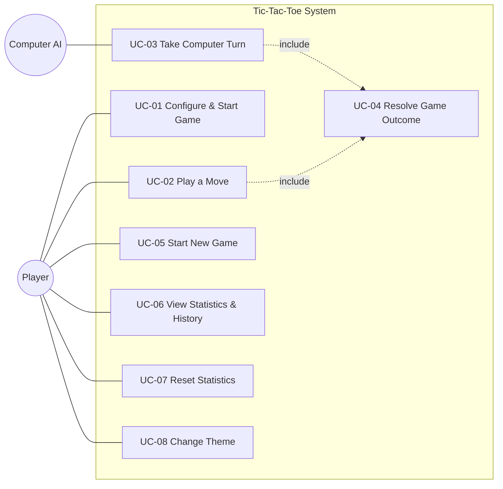

# Use-Case Specifications — Tic-Tac-Toe Game

- **Version:** 1.0
- **Date:** 2026-07-09
- **Companion to:** `docs/srs.md`

## Actors

- **Player** — a human interacting with the game (either the solo player in vs.
  Computer mode, or either of the two humans in Local Two-Player mode).
- **Computer (AI)** — the system's automated opponent (a secondary/system actor).

## Use-Case Diagram

---

## UC-01 — Configure & Start Game

- **Actors:** Player
- **Traces to:** FR-MODE-001, FR-MODE-002, FR-MODE-003, FR-MODE-004, FR-MODE-005, FR-GAME-001
- **Preconditions:** The application is loaded.
- **Postconditions:** A fresh game is displayed with an empty board and `X` to move.

**Main success scenario:**
1. Player opens the setup screen.
2. Player selects a mode (vs. Computer or Local Two-Player).
3. If vs. Computer, Player selects a difficulty (Easy / Medium / Hard) and, optionally, whether to play first.
4. Player starts the game.
5. System renders an empty 3×3 board and indicates it is `X`'s turn.

**Alternate flows:**
- 2a. Player accepts the remembered previous settings and starts immediately (FR-MODE-005).
- 3a. Player chooses to play second (`O`); the AI takes the first move (see UC-03).

---

## UC-02 — Play a Move

- **Actors:** Player
- **Traces to:** FR-GAME-002, FR-GAME-003, FR-GAME-004, FR-GAME-005, FR-GAME-006
- **Preconditions:** A game is in progress and it is a human player's turn.
- **Postconditions:** The chosen cell holds the player's mark, and turn/outcome are updated.

**Main success scenario:**
1. Player selects an empty cell.
2. System places the active player's mark in that cell.
3. System evaluates the outcome (include UC-04).
4. If the game continues, System passes the turn to the other player and updates the turn indicator.

**Exception flows:**
- 1a. Player selects an occupied cell → System ignores the input (FR-GAME-003).
- 1b. Player attempts a move after the game has ended → System ignores the input (FR-GAME-004).

---

## UC-03 — Take Computer Turn

- **Actors:** Computer (AI)
- **Traces to:** FR-AI-001, FR-AI-002, FR-AI-003, FR-AI-004, FR-AI-005
- **Preconditions:** A vs. Computer game is in progress and it is the AI's turn.
- **Postconditions:** The AI's mark occupies a legal cell; turn/outcome are updated.

**Main success scenario:**
1. System determines it is the AI's turn.
2. After a brief delay, System computes a legal move according to the selected difficulty.
3. System places the AI's mark.
4. System evaluates the outcome (include UC-04).
5. If the game continues, System returns the turn to the Player.

**Alternate flows:**
- 2a. Easy → random legal move (FR-AI-001).
- 2b. Medium → win-if-possible / block-if-needed, else random (FR-AI-002).
- 2c. Hard → optimal minimax move (FR-AI-003).

---

## UC-04 — Resolve Game Outcome

- **Actors:** — (included by UC-02 and UC-03)
- **Traces to:** FR-GAME-007, FR-GAME-008, FR-GAME-009, FR-GAME-010, FR-STATS-001, FR-STATS-002, FR-STATS-007
- **Preconditions:** A mark has just been placed.
- **Postconditions:** If the game ended, the result is shown and stats are updated.

**Main success scenario:**
1. System checks for a winning line.
2. If a win exists, System highlights the winning line and announces the winner.
3. If no win and the board is full, System announces a draw.
4. On game end, System records the result to statistics and match history.

**Alternate flows:**
- 1a. No win and board not full → the game continues; no outcome is recorded.

---

## UC-05 — Start New Game

- **Actors:** Player
- **Traces to:** FR-GAME-011, FR-GAME-012
- **Preconditions:** A game exists (in progress or ended).
- **Postconditions:** A fresh board is presented with the current settings.

**Main success scenario:**
1. Player selects "New Game".
2. System clears the board and starts a fresh game with the current mode/settings, `X` to move.

**Alternate flows:**
- 1a. Player chooses to return to setup to change mode/difficulty (FR-GAME-012), leading to UC-01.

---

## UC-06 — View Statistics & History

- **Actors:** Player
- **Traces to:** FR-STATS-003, FR-STATS-004, FR-STATS-005, FR-UI-002
- **Preconditions:** The application is loaded.
- **Postconditions:** The Player sees current stats and history.

**Main success scenario:**
1. Player navigates to the statistics view.
2. System loads persisted statistics and history from `localStorage`.
3. System displays win/loss/draw summary counts and the chronological match history.

**Alternate flows:**
- 2a. No stored stats yet → System shows zeroed counts and an empty history.

---

## UC-07 — Reset Statistics

- **Actors:** Player
- **Traces to:** FR-STATS-006, FR-UI-003
- **Preconditions:** Statistics view is available.
- **Postconditions:** All stats and history are cleared (if confirmed).

**Main success scenario:**
1. Player selects "Reset Statistics".
2. System asks for confirmation.
3. Player confirms.
4. System clears all statistics and match history from `localStorage` and shows zeroed data.

**Alternate flows:**
- 3a. Player cancels → no change is made.

---

## UC-08 — Change Theme

- **Actors:** Player
- **Traces to:** FR-THEME-001, FR-THEME-002, FR-THEME-003
- **Preconditions:** The application is loaded.
- **Postconditions:** The selected theme is applied and persisted.

**Main success scenario:**
1. Player toggles the theme control.
2. System applies the chosen light/dark theme immediately.
3. System persists the selection for future sessions.

**Alternate flows:**
- 0a. On first load, System applies the OS/browser color-scheme preference by default (FR-THEME-002).
