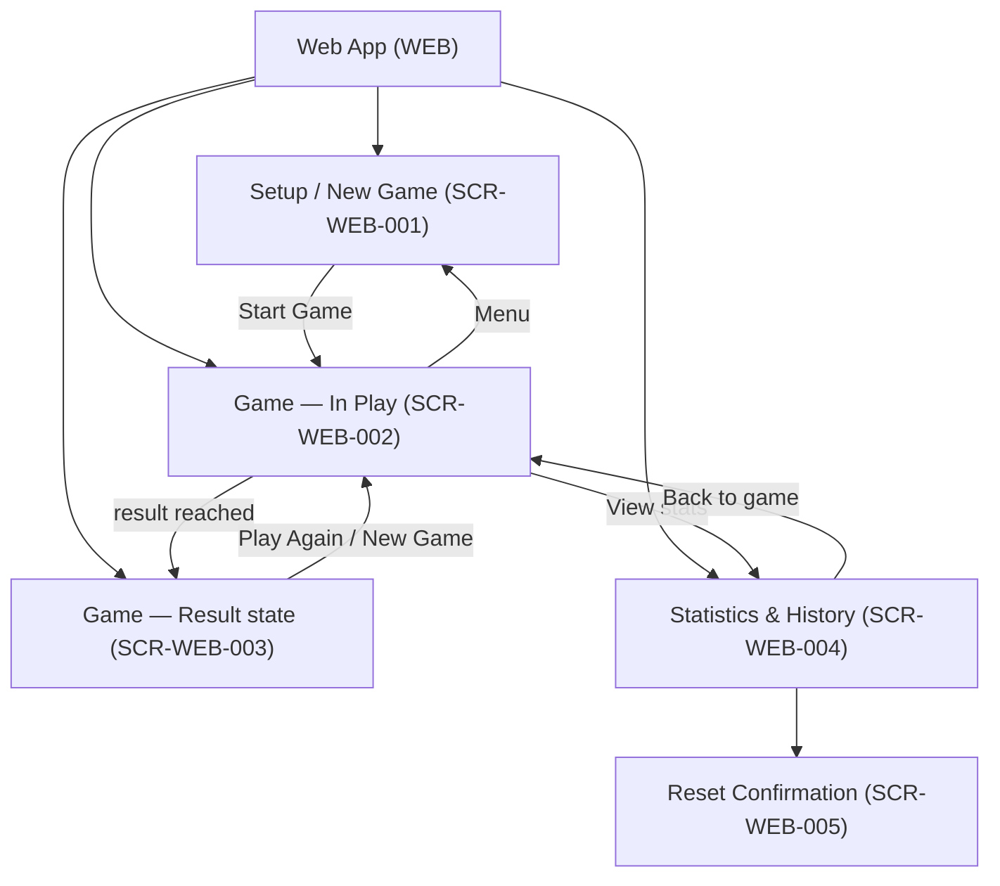
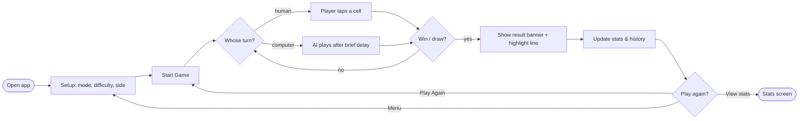
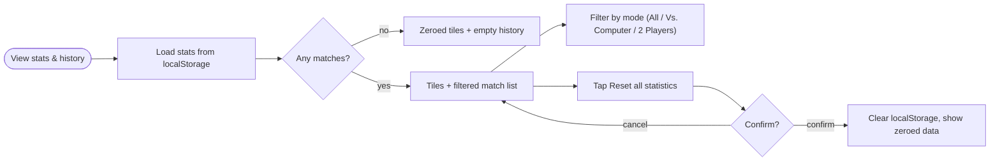

# UX Foundations: Tic-Tac-Toe Game

> Status: Draft · Last updated: 2026-07-13
> Sources: docs/srs.md · docs/architecture.md · docs/use-cases.md
> Design system: **docs/design.md + docs/tokens.json** (single source of truth for
> all design values — this document references, never restates them)

## 1. Overview

A lightweight, client-side web Tic-Tac-Toe game: play the classic 3×3 game against
a computer opponent (Easy / Medium / Hard) or another person on the same device,
with locally-persisted stats and match history, in a light or dark theme.

This product has **one UI surface**:

- **Web App — surface code `WEB`** — a single responsive web page (the SPA
  described in `architecture.md` §5), used by casual and competitive players on
  desktop and mobile browsers.

Design-source mode: **design file** — codified from the confirmed Claude Design
mockups (see design.md §9 Provenance).

---

## Part A — Shared Core (summary; authority lives in design.md)

### A1. Brand and visual direction

Warm, rounded, "premium casual game" personality: a warm-paper canvas, soft
high-radius cards under a single feather-light shadow, a rounded humanist sans set
heavy for marks and headings. Two player colors run throughout — **X blue, O
orange** — with green reserved for wins. Full visual direction and atmosphere:
**design.md §1**. Provenance: **design.md §9**.

### A2. Voice and tone

Friendly, plain, and encouraging; second person; states named directly and
consequences spelled out before destructive actions. Full microcopy do/don'ts:
**design.md §6**.

### A3. Design language summary

Warm-neutral palette (paper `--bg`, near-black `--ink`) with two semantic accent
pairs (X/blue, O/orange) plus a win green; a single rounded sans on an 11→58px
scale weighted 600/700/800; low, touch-friendly density on one centered 460px
column with a 22px section rhythm and a single soft elevation. **Token values live
in design.md §2 / tokens.json; component specs and states in design.md §4.** No
value tables here.

### A4. Accessibility standard

Target: **best-effort accessibility with no formal WCAG conformance committed for
v1** (per **NFR-A11Y-001**), honoring these binding rules: state never conveyed by
color alone (**NFR-USE-003**), interactive targets ≥ 44×44px (**NFR-USE-002**),
and always-visible focus (added in this phase — the mockups omit it). Mechanical
rules and the per-pairing contrast analysis: **design.md §5** and **§2**.

### A5. Cross-surface principles

Single surface, so "cross-surface" is minimal, but two product-wide interaction
rules hold:
- **Destructive actions require explicit confirmation** (FR-UI-003) — reset stats
  goes through a confirm dialog (`SCR-WEB-005`), never a one-tap wipe.
- **Persistence degrades silently** — if `localStorage` is unavailable the app
  stays fully playable for the session with no error wall (NFR-REL-002); stats
  simply don't persist.

---

## Part B — Surfaces

### B1. Web App — surface code `WEB`

#### Users and primary jobs

Two user classes, both low-setup, from **SRS §2.3**:

- **Casual Player** (SRS §2.3) — wants a quick game, solo vs. AI or with a friend
  on one device; expects zero setup.
- **Competitive Player** (SRS §2.3) — wants a real challenge (Hard AI) and tracks
  results/streaks over time.

Top jobs (each seeds a flow and screens):
1. Start a game with the mode/difficulty/side they want (UC-01).
2. Play moves and read whose turn it is (UC-02).
3. Play against the computer at a chosen difficulty (UC-03).
4. See the outcome — win, lose, or draw — clearly (UC-04).
5. Play again quickly, or return to setup to change things (UC-05).
6. Review win/loss/draw stats and match history (UC-06).
7. Reset stats; switch light/dark theme (UC-07, UC-08).

#### Information architecture & navigation

Flat, three-view app with a persistent top bar (wordmark + theme toggle on Setup
and Game; wordmark + "Back to game" on Stats). No deep hierarchy; navigation is
lateral: Setup → Game, Game ↔ Stats, Game → Setup ("Menu"). The theme toggle is
global.

#### Key user flows

**Configure & play a game [UC-01, UC-02, UC-03, UC-04]:**

**Review & reset statistics [UC-06, UC-07]:**

#### Screen / page inventory

Stable `SCR-WEB-<NNN>` IDs — never renumbered or recycled; downstream slices and
the per-slice ui-design step reference these.

| ID | Screen | Purpose | Key states | Realizes |
| :-- | :----- | :------ | :--------- | :------- |
| SCR-WEB-001 | Setup / New Game | Choose mode, difficulty, and side; start a game | mode = vs-computer (shows difficulty + side) vs. 2-player (hides them); remembered defaults | UC-01 · FR-MODE-001..005, FR-GAME-001 |
| SCR-WEB-002 | Game — In Play | Play the board; scoreboard, turn indicator, actions | human turn, computer thinking, cell hover/ghost, occupied/ended input ignored | UC-02, UC-03, UC-05 · FR-GAME-001..006, FR-AI-004 |
| SCR-WEB-003 | Game — Result | Game-end state of the board: result banner + winning-line highlight | win (X or O), **draw** (neutral variant) | UC-04 · FR-GAME-007..011, FR-STATS-007 |
| SCR-WEB-004 | Statistics & History | Show W/L/D tiles, mode filter, and match history | empty (no matches), populated, filtered by mode | UC-06 · FR-STATS-003, FR-STATS-004, FR-UI-002 |
| SCR-WEB-005 | Reset Confirmation | Confirm before clearing all stats/history | confirm, cancel | UC-07 · FR-STATS-006, FR-UI-003 |

Notes: SCR-WEB-003 is the game-end **state** of the game screen (same layout as
SCR-WEB-002 with the result banner and highlighted line), catalogued separately
because implementation and ui-design treat it as a distinct state to build.
SCR-WEB-005 is a modal dialog over SCR-WEB-004. The **theme toggle** (UC-08) is a
global control present on every screen, not a screen of its own.

#### Surface-specific components

None beyond the core — the single-surface component set in **design.md §4** *is*
the full inventory (board, cell, buttons, segmented control, cards, badges, turn
indicator, toggle, mode-card, play-as-pill, result-banner, stat-tile,
history-list, back-button, confirmation dialog).

#### Token overrides

None. The shared core is the only token set (single surface). *(This is the healthy
default and means the core is doing its job.)*

---

## Part D — Open Questions and Risks

- **Reset confirmation dialog** (SCR-WEB-005) and the **draw** result variant are
  specified as designed defaults in design.md, not present in the source mockups —
  validate their exact look when building.
- **Local 2-player labeling:** the scoreboard `card` needs a 2-player variant
  (player labels instead of "Computer / Hard AI"); it's a content variant of the
  same component, but confirm copy ("Player 1 / Player 2" vs. "X / O").
- **Accessibility bar is best-effort by SRS choice (NFR-A11Y-001).** The palette
  has known small-text contrast limits (`--muted`, `--o`/`--win`) handled via
  `--muted-strong` and large-text-only usage; if a formal AA commitment is ever
  wanted, revisit those tokens (see design.md §5/§9).
- **Dark-theme values are a derivation**, contrast-checked by estimate only —
  verify against real rendering before shipping dark mode.
- **Keyboard play** is not a committed interface in the SRS (§5.2); focus states
  are specified so it's *possible*, but full keyboard-first play isn't a v1 goal.
